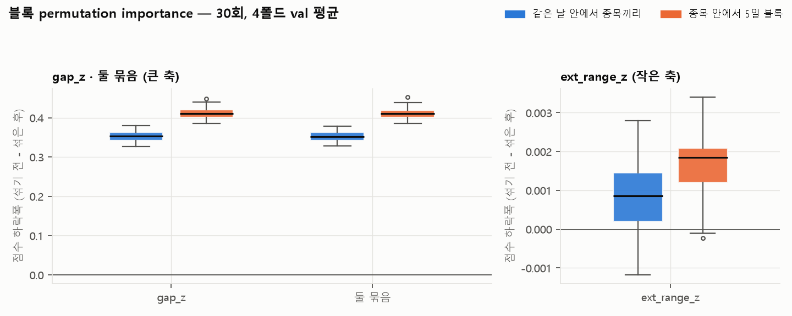
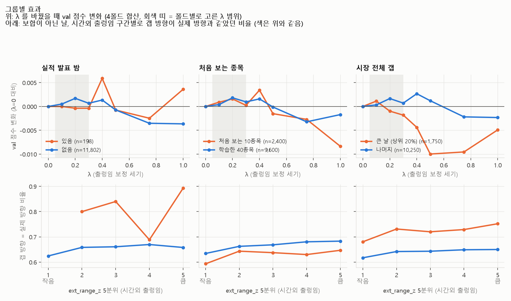

# 제출 규칙 설명가능성 분석

> 제출 규칙(`gap_z + ext_range_z`)이 **실제로 무엇에 기대서 예측하는지**를 강의 w6-1 의 방법 세 가지로 뜯어봤습니다.
> (02 문서 1~3번의 결과)

작성 2026-10-07 · 민영(B) · 재현 방법은 맨 아래

---

## 3줄 요약

1. **규칙은 거의 전부 gap_z 에 기댑니다.** gap_z 를 섞으면 점수가 0.35~0.41 떨어지고, ext_range_z 는 0.001~0.002.
2. **"출렁인 갭은 잡음이라 덜 믿는다"는 설명은 틀렸습니다.** 출렁임이 클수록 갭 방향은 오히려 더 잘 맞습니다(62% → 68%). ext_range_z 는 "급등락 칸까지 갈지"를 조금 조정할 뿐이고, 효과(+0.003)는 갭 크기에 따라 반대라 상쇄됩니다.
3. **시간외 봉 고가·저가에 잘못 찍힌 체결가가 많습니다** (16시 봉의 9.7%). ext_range_z 가 이걸 같이 잽니다.

**발표 문구 제안**

> ~~"시간외에 크게 출렁인 갭은 잡음이라 덜 믿는다"~~
> → **"규칙은 방향을 갭에서 가져오고, 시간외 출렁임으로 급등락 칸까지 갈지를 조금 조정한다. 그 조정의 효과는 작고(+0.003), 그룹별로 방향이 달라 상쇄된다."**

---

## 1. 예측 분해표 (w6-1 p5, p7)

규칙은 계산식이 단순해서 SHAP 같은 근사 없이 예측 하나를 **정확히** 분해할 수 있습니다 (강의의 "트리 경로 = 정확한 설명"과 같은 성질).
fold4 (train 으로 고른 값: λ 0.2, a 0.061, b 0.256) 의 val 에서 미리 정한 규칙으로 세 행을 골랐습니다.

| 단계 | ① 급등락을 맞힌 행 | ② 정반대로 찍은 행 | ③ 보정으로 등급이 바뀐 행 |
|---|---|---|---|
| 종목 · 대상일 | AMD · 2026-04-01 | GLW · 2026-05-27 | AMZN · 2026-05-19 |
| 시간외 갭 | +2.10% | +1.51% | −0.77% |
| vol20 | 3.57% | 5.69% | 1.31% |
| **gap_z** = 갭 ÷ vol20 | +0.588 | +0.265 | −0.586 |
| ext_range_z | 0.89 | 0.56 | **28.95** |
| x̃ = ext_range_z 를 train 기준으로 표준화 | −0.10 | −0.16 | +4.37 |
| 보정 exp(−0.2·x̃) | ×1.021 | ×1.032 | **×0.417** |
| **s** = gap_z × 보정 | +0.601 | +0.273 | −0.244 |
| 예측 (보정 없으면) | 급상승 (급상승) | 급상승 (급상승) | **하락 (급하락)** |
| 정답 · 실제 등락 | 급상승 · +3.37% | 급하락 · −2.67% | 하락 · −2.08% |
| 벌점 | 0 | **64** | 0 |

- **②** 는 A 발표 8장 "반대로 찍은 96행"의 전형입니다. 변동성 큰 종목(vol20 5.7%)의 평범한 갭(+1.5%)이 경계 b 를 겨우 넘어 급상승으로 찍혔고, 장중에 반대로 크게 갔습니다. 이 한 행이 벌점 64 입니다.
- **③** 의 ext_range_z 28.95 는 실제 출렁임이 아니라 **잘못 찍힌 체결가**입니다 (AMZN 16시 봉: 시가·종가 264 인데 고가 327, 저가 227). 결과가 맞은 건 우연입니다 (4절).

**출렁임 보정이 바꾼 행 (fold4 val 3,000행)**

- 등급이 바뀐 행: **87행 (2.9%)**
- 바뀐 방향: 한 칸 올림 44 (하락→급하락 26, 상승→급상승 18) · 한 칸 내림 22 (급상승→상승 12, 급하락→하락 10) · 보합 경계 21
- 결과: 나아짐 29 · 나빠짐 28 · 같음 30 (벌점 합 241 → 228)
- 점수: 보정 없음 0.5124 → 있음 0.5154 (**+0.003**)

→ 보정은 "출렁인 갭을 깎는" 쪽보다 **"출렁임이 작은 갭을 한 칸 올리는"** 쪽에서 더 많이 작동합니다 (x̃ < 0 이면 보정이 1보다 큼).

---

## 2. 블록 permutation importance (w6-1 p15~18)

학습한 규칙은 그대로 두고, val 에서 열 하나를 섞었을 때 점수가 얼마나 떨어지는지 봤습니다 (30회 × 4폴드).
- **같은 날 안에서 종목끼리 섞기:** 그날 시장 국면은 두고 종목 정보만 끊음
- **종목 안에서 5일 블록 섞기:** 시계열 덩어리를 유지 (강의 p17 "시계열은 블록으로")
- **둘 묶음:** 두 열을 같은 순서로 함께 섞음 (p18)

| 피처 | 같은 날 안에서 | 5일 블록 | 폴드별 (같은 날 안에서) |
|---|---:|---:|---|
| gap_z | 0.352 ± 0.013 | 0.412 ± 0.017 | 0.31 / 0.35 / 0.35 / 0.40 |
| ext_range_z | 0.0008 ± 0.0010 | 0.0016 ± 0.0009 | 0.0008 / 0.0028 / **−0.0015** / 0.0011 |
| 둘 묶음 | 0.352 ± 0.013 | 0.412 ± 0.017 | gap_z 와 같음 |

± 는 30회 반복의 표준편차 (반복마다 4폴드 평균)

- 규칙은 **gap_z 에 거의 전부 기댑니다.** 섞으면 val 점수(0.40~0.52)가 0.05~0.12 까지 떨어집니다.
- ext_range_z 는 작고 폴드마다 다릅니다. **fold3 에서는 섞은 쪽이 오히려 높았습니다** (30회 중 73~80% 가 0 이하).
  - 기존 B 문서의 "4폴드 모두 상승"은 λ 를 다시 골라 비교한 결과라 질문이 다릅니다. 둘을 합치면 **"작고 불안정한 개선"** 입니다.
- 둘 묶음 ≈ gap_z 단독 → 두 피처가 정보를 나눠 갖는 문제는 없습니다 (순위상관 0.00).
- 강의 p19 대로 이건 "모델이 무엇에 기대는가"이지 "시장이 무엇으로 움직이는가"가 아닙니다.

---

## 3. 그룹별 효과 (w6-1 p20~22)

λ(출렁임 보정 세기)를 0 ~ 1.0 으로 바꿔 가며 폴드마다 경계 a, b 를 train 으로 다시 고르고, 4폴드 val 을 합쳐 그룹별 점수를 냈습니다.
그룹은 라벨 없이 미리 정했습니다: 실적 발표가 있던 밤 · 처음 보는 10종목 · 시장 전체 갭이 큰 날(상위 20%).

### 3.1 λ 를 바꿨을 때 점수 변화 (λ=0 대비)

| 그룹 | λ=0 점수 | λ 0.2 | λ 0.4 | λ 0.5 | λ 1.0 |
|---|---:|---:|---:|---:|---:|
| 전체 (12,000행) | 0.451 | +0.002 | +0.002 | −0.001 | −0.004 |
| 시장 갭 큰 날 (1,750) | 0.619 | −0.001 | −0.004 | **−0.010** | −0.005 |
| 시장 갭 나머지 (10,250) | 0.414 | +0.002 | +0.003 | +0.001 | −0.002 |
| 처음 보는 10종목 (2,400) | 0.374 | +0.002 | +0.003 | −0.002 | −0.008 |
| 학습한 40종목 (9,600) | 0.471 | +0.002 | +0.002 | 0.000 | −0.002 |
| 실적 발표 밤 (198) | 0.811 | 0.000 | +0.006 | −0.001 | +0.004 |

- 전체로는 λ 0.2~0.4 에서 +0.002 가 최대, 0.5 부터 떨어집니다 (폴드별로 고른 λ 0.05~0.3 과 맞음).
- **시장 전체가 크게 움직인 날에는 보정이 손해입니다.** A 발표 9장의 "시장 변동성이 클 때만 급등락을 더 찍는 게 나았다"와 같은 방향입니다.
- **처음 보는 종목도 모양이 같습니다.** 처음 보는 종목 점수가 낮은 이유(0.374 vs 0.471)는 출렁임 보정이 아닙니다 → 02 문서 12번.
- 실적 발표 밤은 198행뿐이라 들쭉날쭉하지만, 규칙 점수가 0.81 로 매우 높습니다 (갭이 실적을 이미 반영).

### 3.2 출렁임이 크면 갭 방향이 덜 맞나?

**아니요, 오히려 더 잘 맞습니다.** 보합이 아닌 날, 출렁임 1분위 62.4% → 5분위 67.6%.

### 3.3 그럼 보정은 왜 도움이 되나: 갭 크기에 따라 효과가 반대

갭과 같은 방향으로 급등락한 비율 (전 기간, 설명용):

| \|gap_z\| \ 출렁임 | 1 (작음) | 2 | 3 | 4 | 5 (큼) |
|---|---:|---:|---:|---:|---:|
| 작음 | 5.3% | 4.7% | 4.6% | 4.9% | 4.0% |
| **중간** | **10.7%** | 7.5% | 7.6% | 7.8% | **6.0%** |
| **큼** | **19.4%** | 19.3% | 17.2% | 21.0% | **24.1%** |

- **갭이 중간 크기:** 출렁임이 작으면 급등락까지 가는 비율이 높고(10.7%), 크면 낮음(6.0%) → **보정이 맞음.** 1절에서 "한 칸 올린" 44행이 여기
- **갭이 클 때:** 출렁임이 클수록 급등락이 많음(19.4% → 24.1%) → **보정이 손해**
- 두 효과가 상쇄돼 평균 효과가 +0.003 에 그칩니다 (강의 p21 "평균이 평평해도 그룹끼리 반대로 움직인다" 사례).

> ⚠️ 갭 크기와 출렁임을 같이 쓰는 규칙은 이 표(val 포함 전 기간)를 보고 만든 것이라 **지금 채택하면 안 됩니다.** 만든다면 새 데이터로만 검증해야 합니다.

---

## 4. 새로 발견: 시간외 봉의 잘못 찍힌 체결가

ext_range_z = (시간외 최고가 − 최저가) ÷ 종가 ÷ vol20 인데, 고가·저가에 비정상 체결가가 자주 섞여 있습니다.

| 확인 | 결과 |
|---|---|
| 시간외 범위가 10% 넘는 행 | 22,400행 중 **1,432행** (대형주에서 정상적으로는 드문 크기) |
| 가장 큰 값 | AVGO 2024-10-28, 범위 898% (ext_range_z 441) |
| 봉 몸통 밖으로 5% 넘게 튄 꼬리 | 시간외 봉 209,289개 중 2.9%. **16시 봉 2,166개(9.7%), 17시 봉 2,402개**에 몰림 (장 마감 직후) |

- gap 은 봉 종가만 써서 영향이 작지만, ext_range_z 는 이 이상치를 그대로 잽니다.
- **10/8 확인 ([06 문서](06_배치_실험.md)):** 이상치를 뺀 두 정의(봉 종가 기준, 16시 봉 제외)로 다시 비교하니 **오히려 나빠짐** (−0.003, −0.002). 지금 정의를 그대로 둡니다. 튀는 고가·저가 자체가 "시간외 거래가 불안정했다"는 신호일 수 있습니다.

---

## 5. 발표·팀에 전할 것

**발표**
- 규칙 설명 장: 1절 분해표 한 장. "우리 규칙은 예측 하나하나를 정확히 설명할 수 있다" (w6-1 intrinsic)
- 중요도: 2절 permutation 그림. "규칙은 갭에 기대고, 출렁임 보정은 작고 불안정하다"를 숨기지 않고 보여 주기
- 해석 정정: "출렁인 갭 = 잡음" 대신 3.3 표. 강의 p21 "그룹끼리 상쇄" 사례로 소개

**재은**
- λ 고정 vs 선택: 제출본 λ 는 0.40. 전체로는 0.2 와 0.4 가 같지만 시장 갭 큰 날에는 0.4 가 −0.004
- 처음 보는 종목: 출렁임 보정은 원인이 아님 → 02 문서 12번

**데이터**
- 시간외 고가·저가 이상치 (4절)

---

재현 방법

- 실행: `uv run python work/b/review/explain/explain_rule.py` (약 2분)
- 코드: [explain/explain_rule.py](../../work/b/review/explain/explain_rule.py) · 그림: [explain/figs/](../../work/b/review/explain/figs/) · 결과 CSV: `explain/out/` (git 에 안 올림, 실행하면 생김)
- 데이터: `cache/gapz_rule.parquet` (guard 아래 만든 피처 표 22,450행), A 폴드 `lab/folds.json`
- 그룹·섞는 법·반복 수(30)·λ 격자는 실행 전에 정했고, 결과를 보고 바꾸지 않음

