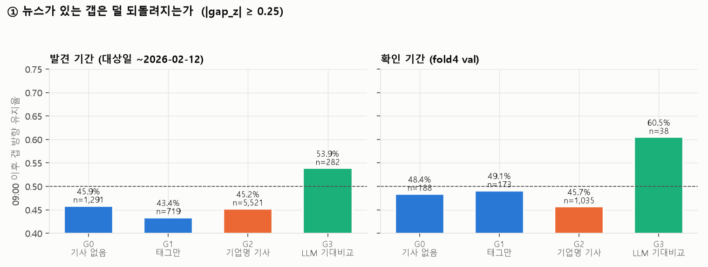
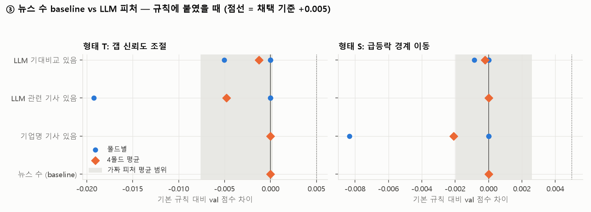

# 뉴스·시장 실험 — 뉴스 있는 갭, 시장 전체가 뒤집힌 날, 뉴스 수 baseline

> B 데이터(갭)에 뉴스·Reddit·채민 LLM 피처를 붙여, **"갭을 언제 믿을지"** 를 텍스트로 알 수 있는지 세 가지로 시험했습니다.
> 그룹·판정 기준·후보 격자는 실행 전에 스크립트 맨 위에 고정했고, 결과를 보고 바꾸지 않았습니다.

작성 2026-10-08 · 민영(B) · 채민 뉴스 **공백 보정본**(`llm_news_v6_dev_handoff_whitespace_fixed.zip`, 10/8 15:19) 기준 · 강의 w4-2 p14–15, w5-1 p25·p39 · 재현 방법은 맨 아래

---

## 3줄 요약

1. **① 뉴스 유무로는 갭이 얼마나 되돌려지는지 차이가 없습니다.** 기사 없음 / 태그만 / 기업명 기사 세 그룹의 갭 방향 유지율이 모두 45% 안팎입니다. 다만 **실적 결과가 담긴 기사(LLM 기대 비교)가 있는 갭은 덜 되돌려집니다** (54% vs 46%, 확인 기간에도 같은 방향).
2. **② 시장 전체가 뒤집힌 날은 아침 정보로 미리 알 수 없었습니다.** 전체 뉴스 수, Reddit 글 수, 시장 갭 크기 등 7개 후보 모두 판정 기준을 못 넘었습니다.
3. **③ 뉴스 수 baseline 도, LLM 피처도 규칙을 개선하지 못했습니다.** 대부분 train 이 가중치 0 을 골랐고, 남은 차이는 가짜 피처 범위 안입니다. **LLM 피처가 기사 수보다 나은 것도 아닙니다.**

**발표에 쓸 문장**
> "뉴스 양이나 LLM 판단을 갭 규칙에 더해도 점수가 오르지 않았다. 9시 갭이 밤사이 뉴스를 이미 반영하고 있기 때문으로 보인다. 다만 실적 결과가 담긴 뉴스가 있는 큰 갭은 장중에 덜 되돌려졌다."

---

## ① 뉴스 있는 갭 vs 없는 갭

**질문:** 뉴스 없이 혼자 튄 갭은 장중(09:00 → 종가)에 더 많이 되돌려지는가? (10/3 B 문서 6절에 미리 적어 둔 가설)

**방법**
- 대상: |gap_z| ≥ 0.25 인 행. 뉴스는 기준일 16:00 ~ 대상일 09:00 (갭 가격과 같은 시점까지)
- 그룹
  - **G0** 태그 기사 없음
  - **G1** 태그 기사는 있지만 제목에 기업명 없음
  - **G2** 기업명이 나온 기사 있음 (규칙 기반, 채민 v6 후보 필터와 같은 기업명 규칙)
  - **G3** 채민 LLM 이 기대 비교(실적 상회·하회 등)를 확인한 관련 기사 있음
- 지표: 갭 방향 유지율 = 09:00 이후 움직임이 갭과 같은 방향인 비율
- 판정: (G2∪G3) − G0 차이가 5%p 이상이고 날짜 묶음 부트스트랩 95% 구간이 0 을 안 걸치면 "차이 있음"

| 그룹 | 발견 기간 유지율 (n) | 확인 기간 유지율 (n) |
|---|---:|---:|
| G0 기사 없음 | 45.9% (1,291) | 48.4% (188) |
| G1 태그만 | 43.4% (719) | 49.1% (173) |
| G2 기업명 기사 | 45.2% (5,521) | 45.7% (1,035) |
| **G3 LLM 기대 비교** | **53.9%** (282) | **60.5%** (38) |

발견 = 대상일 ~2026-02-12, 확인 = fold4 val

| 비교 | 발견 기간 차이 [95% 구간] | 확인 기간 차이 |
|---|---|---|
| **(G2∪G3) − G0** (사전 판정) | −0.2%p [−3.9, +3.5] | −2.2%p |
| G3 − G0 | **+8.0%p [+1.3, +14.7]** | +12.1%p [−7.7, +29.1] |
| G1 − G0 | −2.5%p [−7.5, +2.7] | +0.7%p |

**판정: 차이 없음.** 기사가 있든 없든, 기업명이 나오든 안 나오든 갭은 비슷하게 (절반 조금 넘게) 되돌려집니다.

**G3 만 다른 이유 (사후 확인)**
G3 는 갭 크기가 훨씬 큽니다 (|gap_z| 중앙값 1.04 vs 0.45). 그래서 갭 크기별로 나눠 봤습니다.

| 갭 방향 유지율 | \|gap_z\| 0.25~0.5 | 0.5~1 | 1~2 | 2 이상 |
|---|---:|---:|---:|---:|
| G0 기사 없음 | 47.5% | 47.3% | 38.7% | 33.3% |
| G2 기업명 기사 | 47.1% | 45.1% | 37.9% | 39.7% |
| **G3 LLM 기대 비교** | 53.4% | 47.2% | **60.3%** | **55.1%** |

- **큰 갭(|gap_z| ≥ 1)에서 차이가 뚜렷합니다.** 실적 기사 없이 크게 튄 갭은 장중에 60% 이상 되돌려지는데, 실적 결과 기사가 있는 큰 갭은 절반 넘게 유지됩니다.
- 실적 발표 밤인데 G3 가 아닌 경우는 그 중간쯤입니다 (1~2: 51.4%).
- ⚠️ 이건 결과를 보고 나눈 **사후 분석**이라 지금 규칙에 넣으면 안 됩니다. 아래 ③에서 `f_llm_cmp` 를 미리 정한 형태로 붙였을 때는 효과가 없었습니다. "큰 갭 × 실적 기사"를 같이 쓰는 규칙은 새 데이터로만 검증할 후보로 남깁니다.

---

## ② 시장 전체가 뒤집힌 날

**질문:** A 발표 8장에서 벌점의 22% 가 몰린 5일처럼, 여러 종목이 함께 갭과 반대로 간 날을 아침 정보로 미리 알 수 있는가?

**방법**
- 결과: 그날 |gap_z| ≥ 0.25 인 종목 중 갭과 반대로 간 비율 (날 단위, 종목 5개 이상인 날)
- 예측 후보 7개 (09:00 전에 알 수 있는 것): 밤사이 전체 뉴스 수와 그 이상치(직전 20일 대비), Reddit 글 수와 그 이상치, |시장 평균 gap_z|, gap_z 의 종목 간 흩어짐, 창 길이(주말·휴일)
- 판정: 발견 기간 Spearman p < 0.05 이고 확인 기간에서 같은 부호

| 예측 후보 | 발견 (374일) ρ | p | 확인 (60일) ρ | 통과 |
|---|---:|---:|---:|:---:|
| 전체 뉴스 수 (log) | −0.039 | 0.45 | +0.211 | ❌ |
| 전체 뉴스 수 이상치 | −0.077 | 0.14 | +0.152 | ❌ |
| Reddit 글 수 (log) | +0.013 | 0.80 | +0.175 | ❌ |
| Reddit 글 수 이상치 | −0.017 | 0.74 | +0.123 | ❌ |
| \|시장 평균 gap_z\| | −0.092 | 0.07 | +0.041 | ❌ |
| gap_z 흩어짐 | −0.041 | 0.43 | −0.133 | ❌ |
| 창 길이 (시간) | −0.026 | 0.62 | +0.319 | ❌ |

**판정: 통과 없음.** 확인 기간(fold4)에서는 뉴스·Reddit 이 많은 날 더 뒤집히는 경향이 보이지만, 발견 기간에는 반대이거나 0 이라 우연과 구분되지 않습니다. 통과한 후보가 없어 규칙 실험(형태 S)은 하지 않았습니다.

---

## ③ 뉴스 수 baseline vs LLM 피처

**질문:** 강의 w5-1 p39 "기사 수가 기준선". LLM 피처가 단순한 기사 수보다 나은가?

**방법:** 네 피처를 제출 규칙에 두 가지 형태로 붙이고, 파라미터는 폴드마다 train 으로만 골랐습니다.

| 피처 | 뜻 |
|---|---|
| **뉴스 수 (baseline)** | log(1 + 태그 기사 수) |
| 기업명 기사 있음 | 제목에 기업명이 나온 기사가 있는가 (규칙 기반) |
| LLM 관련 기사 있음 | 채민 LLM 이 direct/indirect 로 판단한 기사가 있는가 |
| LLM 기대 비교 있음 | 채민 LLM 이 실적 상회·하회 등을 확인한 기사가 있는가 |

- **형태 T (갭 신뢰도):** s = gap_z × exp(−λ·x̃ + γ·피처) — 피처가 있으면 갭을 더 / 덜 믿음
- **형태 S (급등락 경계):** 피처가 있으면 급등락 경계를 낮추거나 높임 (A `fit_rule_size` 와 같은 방식)
- 대조: 뉴스 수를 같은 날 안에서 섞은 **가짜 피처 5개**

| 피처 | 형태 | fold1 | fold2 | fold3 | fold4 | 평균 | train 이 고른 값 |
|---|:---:|---:|---:|---:|---:|---:|---|
| **뉴스 수 (baseline)** | T | 0 | 0 | 0 | 0 | 0 | 전부 0 |
| | S | 0 | 0 | 0 | 0 | 0 | 전부 0 |
| 기업명 기사 있음 | T | 0 | 0 | 0 | 0 | 0 | 전부 0 |
| | S | −0.008 | 0 | 0 | 0 | −0.002 | −0.3 / 0 / 0 / 0 |
| LLM 관련 기사 있음 | T | 0 | −0.019 | 0 | 0 | −0.005 | 0 / −0.1 / 0 / 0 |
| | S | 0 | 0 | 0 | 0 | 0 | 전부 0 |
| LLM 기대 비교 있음 | T | 0 | −0.005 | 0 | 0 | −0.001 | 0 / −0.1 / 0 / 0 |
| | S | 0 | 0 | 0 | −0.001 | 0.000 | 0 / 0 / 0 / 0.1 |
| 가짜 피처 5개 (평균 범위) | T / S | | | | | −0.008 ~ +0.003 | |

값은 기본 규칙 대비 val 점수 차이. 기본 규칙: fold1 0.434 · fold2 0.436 · fold3 0.402 · fold4 0.515

**판정: 채택 없음.** (기준: 평균 +0.005, 3폴드 이상 상승, fold4 하락 없음)
- **뉴스 수 baseline 은 train 이 4폴드 모두 0 을 골랐습니다.** 규칙과 완전히 같습니다. A 의 v2 결과(뉴스 수로 갭 신뢰도 조절 → γ = 0)와 같습니다.
- LLM 피처는 0 이 아닌 값이 골라진 폴드가 있지만, 점수 차이가 가짜 피처 범위(−0.008 ~ +0.003) 안입니다.
- 즉 **LLM 피처는 기사 수보다 낫지 않고, 둘 다 9시 갭에 더할 정보가 없습니다.**

---

## 해석과 한계

**왜 안 되나**
- 9시 시간외 갭이 밤사이 뉴스를 이미 반영합니다. 뉴스가 많은 날은 갭도 이미 커서, 뉴스로 갭을 다시 조정할 여지가 거의 없습니다 (B 10/3 결론 "밤사이 정보는 갭에 이미 있음"과 같음).
- 강의 w5-1 p25·p27(Antweiler & Frank, Kogan)의 "텍스트는 방향보다 크기"와도 맞습니다. 크기는 갭이 이미 알고 있습니다.

**한계**
- 채민 LLM 은 기대 표현(expect·estimate 등)이 있는 기사만 처리해서, "LLM 관련 기사"는 사실상 실적·전망 기사입니다. 일반 뉴스의 LLM 관련성은 시험하지 못했습니다.
- 채민 공백 보정본을 썼습니다 (검증 실패 104 → 41행). 남은 41행은 공백이 아닌 인용 불일치라 빠진 채로 계산했습니다.
- 보정 전 파일로 처음 돌렸을 때와 결론은 같습니다 (G3 차이·채택 없음 그대로, 숫자만 소수점 차이).
- ②는 날 수가 적어서(확인 60일) 검정력이 약합니다.

**다음 데이터에서 검증할 후보 (지금은 채택 안 함)**
- 큰 갭(|gap_z| ≥ 1) × 실적 결과 기사 유무 → 기사 없는 큰 갭은 급등락을 덜 찍기

---

재현 방법

- 실행: `uv run python work/b/review/news_gap/news_gap.py` (몇 분)
- 준비: 채민 `llm_news_v6_dev_handoff_whitespace_fixed.zip` 의 `valid_articles.csv` 를 `cache/llm_news_v6/` 에 풀기 (git 무시 폴더)
- 데이터: `cache/gapz_rule.parquet`, `dataset/news.parquet`, `dataset/reddit/*.posts.parquet`, A 폴드 `lab/folds.json`
- 사후 갭 크기별 표: `news_gap/out/1_posthoc_by_gap.csv` (스크립트 밖에서 따로 계산, 사후 분석)
- 결과 CSV 는 git 에 안 올림 (`*.csv` 무시 규칙)
- 채민 `valid_articles.csv` 의 날짜 표기가 섞여 있어(확장분에 "00:00:00" 붙음) `format="mixed"` 로 읽음

