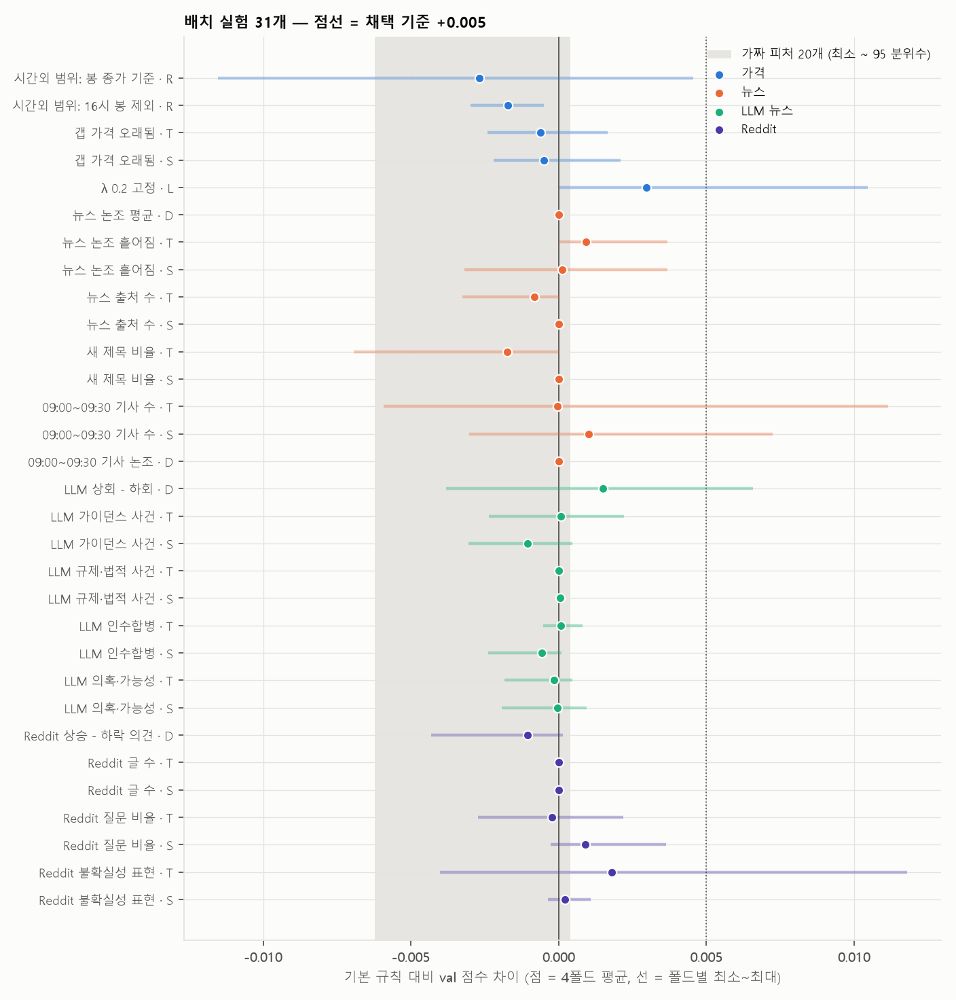

# 배치 실험 31개 — 가격 · 뉴스 · LLM · Reddit

> 그동안 시도하지 않은 피처 19개를 같은 틀로 제출 규칙에 붙여 31개 실험을 한 번에 돌리고, **가짜 피처 20개로 "우연이면 이 정도"라는 기준선**을 같이 만들어 판정했습니다.
> 후보·형태·격자·판정 기준은 실행 전에 스크립트 맨 위에 고정했고, 결과를 보고 바꾸지 않았습니다.

작성 2026-10-08 · 민영(B) · 채민 뉴스 공백 보정본 · Reddit v4 기준 · 재현 방법은 맨 아래

---

## 3줄 요약

1. **채택 0개.** 31개 모두 채택 기준(4폴드 평균 +0.005, 3폴드 이상 상승, fold4 하락 없음)을 못 넘었습니다. 가장 높은 것도 +0.003 입니다.
2. **텍스트 방향 피처 4개는 모두 동전 던지기 수준**입니다 (09:00 이후 움직임과 부호 일치 0.46~0.51). 뉴스 논조, 09:00~09:30 뉴스, LLM 상회−하회, Reddit 의견 모두 같습니다.
3. **실용적인 발견 두 가지**
   - **λ 를 0.2 로 고정하면 train 으로 고를 때보다 한 번도 나빠지지 않았습니다** (fold1 +0.011, 처음 보는 종목 평균 +0.010). 제출본은 λ 0.4 라 참고할 만합니다.
   - **시간외 고가·저가의 이상치를 빼면 오히려 나빠집니다** (−0.002 ~ −0.003). 지금 ext_range_z 정의를 그대로 두는 게 맞습니다 (02 문서 13번 해결).

---

## 무엇을 시험했나

| 묶음 | 피처 | 형태 |
|---|---|:---:|
| 가격 | 시간외 범위를 **봉 종가**로 / **16시 봉 빼고** 다시 계산 (02 문서 13번) | R |
| | 갭 가격이 몇 시간 오래됐나 (02 문서 7번) | T S |
| | λ 0.2 고정 (재은 할 일) | L |
| 뉴스 원본 | 논조 평균 | D |
| | 논조 흩어짐 (w4-2 p44 의견 분산) · 출처 수 · 새 제목 비율 (w5-1 p22 새로움) | T S |
| | **09:00~09:30 기사 수** (갭 가격 뒤에 나온 뉴스, 10/4 회의 안건) | T S |
| | 09:00~09:30 기사 논조 | D |
| 채민 LLM 뉴스 | 상회 − 하회 | D |
| | 가이던스 · 규제·법적 · 인수합병 · 의혹·가능성 사건 비율 | T S |
| 채민 Reddit v4 | 상승 − 하락 의견 | D |
| | 글 수 · 질문 비율 · 불확실성 표현 비율 | T S |

**형태** (파라미터는 폴드마다 train 으로만)
- **T** 갭 신뢰도: 피처에 따라 갭을 더 믿거나 덜 믿음
- **S** 급등락 경계: 피처에 따라 급등락 경계를 낮추거나 높임
- **D** 방향 더하기: 규칙 점수에 피처 방향을 더함 (방향이 있는 피처만)
- **R** ext_range_z 를 다른 범위로 바꿔 규칙 전체를 다시 학습
- **L** λ 고정

**우연 기준선:** 진짜 피처를 같은 날 안에서 섞은 가짜 20개를 같은 형태로 돌림 → 평균 차이 −0.006 ~ +0.001, **95 분위수 +0.0004**, 채택 기준 통과 0/35.

---

## 결과

**가짜 95 분위수는 넘었지만 채택 기준에는 못 미친 것 (6개)**

| 실험 | 형태 | fold1 | fold2 | fold3 | fold4 | 평균 | 처음 보는 종목 |
|---|:---:|---:|---:|---:|---:|---:|---:|
| **λ 0.2 고정** | L | +0.011 | +0.002 | 0 | 0 | **+0.003** | **+0.010** |
| Reddit 불확실성 표현 | T | +0.012 | −0.004 | −0.001 | 0 | +0.002 | +0.013 |
| LLM 상회 − 하회 | D | +0.004 | −0.001 | +0.007 | −0.004 | +0.002 | 0.000 |
| 09:00~09:30 기사 수 | S | +0.007 | +0.001 | −0.003 | −0.001 | +0.001 | +0.004 |
| 뉴스 논조 흩어짐 | T | +0.004 | 0 | 0 | 0 | +0.001 | +0.001 |
| Reddit 질문 비율 | S | 0 | 0 | 0 | +0.004 | +0.001 | −0.001 |

- 31개 중 6개가 가짜 95 분위수를 넘었는데, 우연이라면 1~2개가 넘는 게 보통입니다. 다만 6개 모두 **효과가 +0.003 이하이고 한두 폴드에서만 오른 것**이라, 피처로 쓸 근거는 되지 않습니다.
- **λ 0.2 고정**은 새 피처가 아니라 "파라미터를 덜 고르기"라 성격이 다릅니다 → 아래 별도.

**나머지 25개:** 평균 −0.003 ~ +0.001. train 이 0 을 고른 것(규칙과 완전히 같음)이 많습니다: 뉴스 논조 평균, 09:00~09:30 기사 논조, 출처 수(S), 새 제목 비율(S), LLM 규제·법적, Reddit 글 수.

전체 표: [batch/out/judge.csv](../../work/b/review/batch/out/) (git 에 안 올림, 스크립트로 다시 생성)

**방향 피처 (train 기간, 판정에는 안 씀)**

| 피처 | 판단 있는 행 | 09:00 이후 움직임과 부호 일치 | 갭과 같은 방향 |
|---|---:|---:|---:|
| 뉴스 논조 평균 | 15,594 | 0.508 | 0.530 |
| 09:00~09:30 기사 논조 | 8,415 | 0.504 | 0.528 |
| LLM 상회 − 하회 | 388 | 0.456 | 0.595 |
| Reddit 상승 − 하락 의견 | 638 | 0.486 | 0.594 |

네 개 모두 50% 근처입니다. 텍스트가 갭과 같은 방향을 가리키는 비율(53~60%)은 조금 높지만, 그건 갭이 이미 아는 정보입니다.

---

## 실용적인 발견

### 1. λ 0.2 고정 → 재은·제출 결정에 참고

- train 이 λ 를 고르는 대신 0.2 로 고정하면 4폴드 모두 **같거나 좋아짐** (+0.011, +0.002, 0, 0). 처음 보는 종목은 평균 +0.010.
- fold3·fold4 는 원래도 train 이 0.2 를 골라서 차이가 0 입니다. 오른 건 train 이 0.05 · 0.3 을 고른 fold1·fold2.
- **제출본은 λ 0.4** (train 2026-05-11 까지로 고른 값)인데, 03 문서 3절에서도 λ 0.4 는 시장 갭이 큰 날 −0.004 였습니다.
- 채택 기준(3폴드 상승)은 못 넘지만, 새 정보를 더하는 게 아니라 **고르는 파라미터를 하나 줄이는** 쪽이라 위험이 작습니다. 제출 전에 "λ 0.2 고정 vs train 선택"을 팀에서 정할 재료로 넘깁니다.

### 2. ext_range_z 는 지금 정의가 낫다 (02 문서 13번 해결)

| 범위 정의 | 4폴드 평균 | fold4 |
|---|---:|---:|
| 지금 (고가·저가, 이상치 포함) | 기준 | 기준 |
| 봉 종가 최고 − 최저 | −0.003 | −0.002 |
| 16시 봉 빼고 고가·저가 | −0.002 | −0.001 |

- 03 문서 4절에서 걱정했던 "잘못 찍힌 체결가"를 빼면 오히려 점수가 떨어집니다.
- 고가·저가의 튀는 값 자체가 "시간외에 거래가 불안정했다"는 신호일 수 있습니다. 지금 정의를 그대로 둡니다.
- 확인: 스크립트에서 ext_range_z 를 원본에서 다시 계산해 캐시 값과 비교 → 최대 차이 4×10⁻¹³ (같은 값)

---

## 해석

- 이번 배치까지 합치면 **B 102개 + A 53개 + 05 문서 3종 + 이번 31개**를 시험했고, 제출 규칙(gap_z + ext_range_z)을 확실히 넘은 것은 없습니다.
- 텍스트(원본 뉴스·LLM·Reddit)는 방향을 못 맞히고, 크기 정보는 9시 갭이 이미 갖고 있습니다. 강의 w5-1 p25·p27(Antweiler & Frank, Kogan)의 "텍스트는 방향보다 크기"와 같은 결론입니다.
- 실험을 많이 할수록 우연히 좋아 보이는 결과가 섞입니다. 이번에는 가짜 피처 기준선을 같이 둬서, 작은 개선(+0.001~0.003)을 채택하지 않았습니다.

---

재현 방법

- 실행: `uv run python work/b/review/batch/batch.py` (10분 안팎)
- 준비 (git 무시 폴더):
  - `cache/llm_news_v6/daily_features.csv` ← 채민 `llm_news_v6_dev_handoff_whitespace_fixed.zip`
  - `cache/llm_reddit_v4/daily_features.csv` ← 채민 `reddit_v4_dev_handoff_final (1).zip`
- 데이터: `cache/gapz_rule.parquet`, `dataset/price.parquet`, `dataset/daily.parquet`, `dataset/news.parquet`, A 폴드 `lab/folds.json`
- 뉴스·가격은 기준일 16:00 ~ 대상일 09:30, `known_at < cutoff` 만 사용 (09:00~09:30 피처만 09:00 이후)
- 채민 LLM·Reddit 피처는 채민 창(대상일 09:30 까지) 그대로. 피처가 없는 종목·날짜는 0 (= 그런 기사·글 없음)
- 결과 CSV: `batch/out/` (`cv.csv` 폴드별 전체, `judge.csv` 판정, `direction.csv` 방향 피처)

