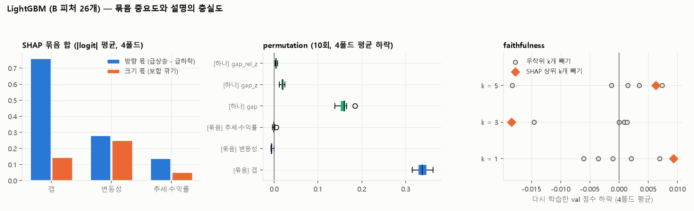

# 남은 항목 정리 — LightGBM 해석 · 실적 × 갭 · 처음 보는 종목 · 텍스트 항목 + 발표 문장 모음

> 01(강의 대조)·02(B 할 일)에서 남아 있던 것 중 **API 없이 할 수 있는 8개**를 한 번에 했습니다. 마지막 절에 05~11 결과까지 합친 **발표 문장 모음**이 있습니다 (02 문서 10번).
> 기준은 실행 전에 스크립트 맨 위에 고정했습니다. 숫자는 모두 개발 4폴드 기준입니다.

작성 2026-10-08 · 정리 2026-10-10 · 민영(B) · 코드: [rest/rest.py](../../work/b/review/rest/rest.py) · 재현 방법은 맨 아래

## 3줄 요약

1. **LightGBM 도 방향은 갭, 크기는 변동성에 기댑니다.** 다만 갭 피처를 하나씩 보면 중요도가 절반으로 보이고(0.18 vs 묶음 0.34), 피처 하나 단위의 SHAP 은 충실도 검사를 통과하지 못합니다 → 묶음으로 읽어야 합니다.
2. **실적 서프라이즈와 갭이 반대인 밤에도 주가는 갭을 따라갑니다.** 처음 보는 종목 점수가 낮은 건 종목 과적합이 아니라 종목 구성과 기간 운입니다.
3. **텍스트 항목(집계 규칙 2개, 재보도, Reddit 작성자)은 효과 없음, 별칭을 넓혀도 놓친 기사는 0.5%.**

## 한눈에

| 항목 | 결과 한 줄 |
|---|---|
| 02-5 LightGBM 묶음 중요도 | 방향 = 갭 묶음, 크기 = 변동성 묶음. **갭 피처는 하나씩 섞으면 중요도가 절반으로 보임** |
| 02-6 faithfulness | SHAP 상위 피처를 빼도 무작위로 뺀 것보다 더 떨어지지 않음 → **피처 하나 단위의 설명은 충실하지 않음** (대체 피처가 있어서) |
| 02-8 실적 × 갭 방향 | 서프라이즈와 갭이 반대여도 **주가는 갭을 따라감** (차이 없음, p = 0.75) |
| 02-12 처음 보는 종목 | 점수가 낮은 건 **주로 종목 구성(운)**, 일부는 학습에서 빠진 영향 (평균 +0.017) |
| 01 집계 규칙 2개 | 비율 대신 "있다·없다"로 바꿔도 효과 없음 (오히려 −0.002) |
| 01 재보도 수 | 재보도 비율 6% 뿐, 효과 없음 (train 이 0 을 고름) |
| 01 Reddit 작성자 | 작성자 수 · 새 작성자 비율 모두 효과 없음 |
| 01 별칭 넓히기 | 뉴스 후보가 **24건(0.5%)만 늘어남** → 10/7 회의 지적의 실제 영향은 작음 |

못 한 것 (API 필요, 팀 규칙상 재은 승인): 02-9 LLM 설명 시연, 01 모델 기억 점검·프롬프트 민감도. FinBERT 는 의도적으로 안 씀.

---

## 02-5. LightGBM 상관 피처 묶음 중요도 (w6-1 p14, p18)

A 의 LightGBM(B 피처 26개, 같은 파라미터·조기 종료·공격성 k 디코딩)을 폴드마다 다시 학습했습니다. fold4 val **0.4954 로 A 결과(0.495) 재현**.

**SHAP 묶음 합 (4폴드 평균)**

| 묶음 | 방향 몫 (급상승 − 급하락) | 크기 몫 (보합 깎기) |
|---|---:|---:|
| 갭 (7개) | **0.76** | 0.14 |
| 변동성 (8개) | 0.28 | **0.25** |
| 추세·수익률 (11개) | 0.14 | 0.05 |

→ A 발표 10장의 "방향은 갭, 크기는 변동성"이 묶음으로 봐도 같습니다.

**permutation (같은 날 안에서 섞기 10회, 4폴드 평균 점수 하락)**

| 섞은 것 | 하락 |
|---|---:|
| **[묶음] 갭 전체** | **0.338** |
| [하나] gap | 0.158 |
| [하나] gap_z | 0.019 |
| [하나] gap_rel_z | 0.005 |
| [묶음] 변동성 전체 | **−0.005** |
| [묶음] 추세·수익률 전체 | 0.000 |

- **갭 피처를 하나씩 섞은 하락을 다 더해도 0.18 인데, 묶음으로 섞으면 0.34.** 하나를 섞으면 나머지가 대신해 줘서 중요도가 절반으로 보입니다. 강의 p18 "상관 피처는 묶어서 섞어라"의 실제 사례입니다.
- **변동성 묶음은 섞으면 오히려 점수가 오릅니다.** LightGBM 이 크기 정보에 기대는 게 점수에는 손해라는 뜻이고, A 발표 9장 "크게 찍기의 비대칭"과 같은 결론입니다.

## 02-6. faithfulness (w6-1 p23)

val SHAP 상위 k 개 피처를 빼고 다시 학습 vs 무작위 k 개를 빼고 다시 학습(5회). 상위를 뺄 때 훨씬 더 떨어져야 "설명이 충실"합니다.

| 뺀 피처 수 | SHAP 상위 k 개 빼기 (4폴드 평균 하락) | 무작위 k 개 빼기 (범위) |
|---|---:|---|
| k = 1 (gap) | +0.009 | −0.021 ~ +0.013 |
| k = 3 | **−0.018** (오히려 오름) | −0.082 ~ +0.024 |
| k = 5 | +0.006 | −0.085 ~ +0.025 |

- **판정: 충실하지 않음.** 상위 피처를 빼도 무작위로 뺀 것과 구분이 안 됩니다.
- 이유: gap 을 빼면 gap_z 가, atr14 를 빼면 range1 이 같은 역할을 합니다. 그리고 LightGBM 이 폴드마다 많이 흔들립니다 (fold1 은 상위 3개를 빼니 +0.097).
- **발표에 쓸 말:** "SHAP 순위를 피처 하나 단위로 읽으면 안 된다. 묶음으로 봐야 한다" (5번과 같은 결론).

## 02-8. 실적 서프라이즈 × 갭 방향 (w5-1 p22)

실적 발표 밤 355건, EPS 서프라이즈 부호와 갭 부호가 같은지로 나눔.

| | n | 09:00 이후 갭 방향 유지 | 갭 방향 급등락 | 반대 방향 급등락 | \|gap_z\| 중앙 |
|---|---:|---:|---:|---:|---:|
| 서프라이즈 = 갭 방향 | 206 | 52.9% | 61.7% | 4.9% | 1.94 |
| **서프라이즈 ≠ 갭 방향** | 149 | 55.0% | **55.7%** | **6.0%** | 1.45 |

- **서프라이즈와 갭이 반대인 밤에도 주가는 갭 쪽으로 갑니다** (갭 방향 급등락 56% vs 반대 6%). 유지율 차이는 없습니다 (Fisher p = 0.75).
- EPS 는 상회했는데 갭이 내린 밤은 가이던스·매출 등 다른 이유가 있었던 것이고, 시장은 그걸 이미 반영했습니다. **"밤사이 실적 정보는 갭에 이미 있다"** 는 B 결론을 실적 밤만 따로 봐도 같습니다.

## 02-12. 처음 보는 종목 점수가 낮은 이유

**(a) 학습에서 뺐을 때 vs 넣었을 때 (그 10종목의 val 점수)**

| | fold1 | fold2 | fold3 | fold4 |
|---|---:|---:|---:|---:|
| 뺐을 때 (지금 방식) | 0.347 | 0.344 | 0.345 | 0.418 |
| 넣었을 때 | 0.388 | 0.346 | 0.346 | 0.439 |
| 참고: 나머지 40종목 | 0.453 | 0.458 | 0.416 | 0.542 |

- 넣으면 조금 오르지만 (평균 +0.017), **넣어도 40종목보다 한참 낮습니다.** 규칙에는 종목별 파라미터가 없어서, 차이는 λ·경계가 그 종목들 데이터를 조금 더 반영한 정도입니다.

**(b) 같은 종목이 계속 낮은가?** 종목별 점수 순위의 폴드 간 상관이 평균 **0.12** (처음 보는 10종목은 0.18). 한 기간에 낮던 종목이 다음 기간에 높기도 합니다 (예: TMO 0.01 → 0.55 → −0.25 → 0.39). **종목 점수의 상당 부분은 그 기간의 운**입니다.

**(c) 그래도 꾸준히 갈리는 성질** (50종목, 4폴드 평균 점수와 순위상관)

| 종목 성질 | 상관 |
|---|---:|
| \|gap_z\| 중앙값 (갭이 큰 종목) | **+0.51** |
| 급등락 비율 | **+0.50** |
| 갭 되돌림 비율 | **−0.44** |
| 시간외 봉 수 | +0.16 |
| ext_range_z | −0.05 |

- 갭이 크고 자주 크게 움직이는 종목(AMD, NEM, AMZN, QCOM)은 점수가 높고, 갭이 작고 잘 되돌려지는 종목(CB, TMO, CVS, WELL)은 낮습니다.
- **처음 보는 10종목 중 5개(TMO, CVS, WELL, NFLX, BKNG)가 하위 6위 안**에 있습니다. 10종목을 고를 때 우연히 "갭 규칙이 잘 안 맞는 종목"이 많이 뽑혔습니다 (처음 보는 10종목 평균 0.351 vs 나머지 0.432).
- **결론: 종목 과적합이 아니라 주로 종목 구성 + 기간 운.** 실제 평가의 새 종목 10개도 어떤 종목이냐에 따라 점수가 크게 달라질 수 있다는 점을 발표 한계에 넣으면 됩니다.

---

## 01 텍스트 항목

| 실험 | 형태 | fold1 | fold2 | fold3 | fold4 | 평균 | train 이 고른 값 |
|---|:---:|---:|---:|---:|---:|---:|---|
| LLM 상회/하회 **있다·없다** | D | +0.004 | 0 | −0.006 | −0.005 | −0.002 | −0.1 / 0 / −0.2 / −0.1 |
| Reddit 상승/하락 **있다·없다** | D | −0.003 | −0.003 | −0.003 | 0 | −0.002 | −0.1 / −0.1 / −0.1 / 0 |
| 고유 사건 수 | T | 0 | −0.002 | 0 | 0 | −0.001 | 0 / −0.1 / 0 / 0 |
| 고유 사건 수 | S | 0 | 0 | 0 | 0 | 0 | 전부 0 |
| 재보도 비율 | T · S | 0 | 0 | 0 | 0 | 0 | 전부 0 |
| Reddit 작성자 수 | T | +0.001 | −0.005 | −0.001 | 0 | −0.001 | 0.1 / −0.2 / 0.1 / 0 |
| Reddit 작성자 수 | S | −0.001 | 0 | −0.001 | 0 | 0.000 | 0.1 / 0 / 0.1 / 0.1 |
| Reddit 새 작성자 비율 | T | 0 | −0.001 | +0.002 | 0 | +0.000 | 0 / −0.2 / −0.2 / −0.2 |
| Reddit 새 작성자 비율 | S | 0 | 0 | 0 | +0.001 | +0.000 | 0 / 0 / 0 / −0.2 |

**판정: 채택 없음** (06 문서와 같은 기준: 채택 기준 + 가짜 피처 95 분위수).

- **집계 규칙 2개 (w5-1 p16–17):** 비율(06 문서, LLM +0.0015 · Reddit −0.001) → 있다·없다 (−0.002 · −0.002). 어느 집계를 써도 결론이 같습니다 ("규칙을 바꿔도 결론이 안 바뀐다"를 보이라는 강의 요구 충족).
- **재보도 (w4-2 p17, p45):** 태그 제목 140만 개를 문자 5-gram 유사도 0.5 로 묶으니 126만 개 사건 → **재보도 비율 6%** 뿐. 같은 제목 제거만으로 대부분 걸러지고, 남은 재보도는 신호가 없습니다 (10/7 회의의 "비슷한 기사도 신호" 논쟁은 실제 영향이 작음).
- **Reddit 작성자 (w4-2 p44):** 계정 생성일이 없어서 "데이터에 처음 나온 지 30일 안 된 작성자"로 대신했습니다. 둘 다 효과 없음.

**별칭 넓히기 (10/7 회의 재은 지적)**

| | 기사 수 |
|---|---:|
| 기대 표현 + 태그 기사 | 28,917 |
| 채민 v6 기업명 규칙 통과 | 4,763 |
| Reddit v4 별칭(Amex, Lilly, Berkshire 등)으로 넓히면 | 4,787 |
| **늘어나는 기사** | **24 (+0.5%)**, 23개 종목·날짜 |

- 늘어나는 건 AXP("AmEx profit beats expectations…") · LLY("Lilly raises full-year earnings forecasts…") · BRK-B 정도입니다.
- **발표에 쓸 말:** "기업명 표기 변형을 넓혀 다시 세어 봤고, 놓친 기사는 0.5% 였다" — 규칙 기반 매칭의 한계를 알고 확인했다는 근거.

---

## 02-10. 발표에 넣을 문장 모음

슬라이드 번호는 A 해설 기준입니다. 근거 문서를 괄호에 적었습니다.

> ⚠️ **숫자 구분:** 아래는 모두 **개발 4폴드**(갭 규칙 평균 0.447) 기준입니다. 재은이 10/10 에 한 번 연 **홀드아웃**(6/1~9/14, 갭 규칙 0.597)과 나란히 쓰지 않습니다. 최종 재학습 모델은 홀드아웃 기간도 학습했으므로 0.597 을 그 모델의 성능으로 쓰지 않습니다.

**정정할 설명**

| 어디 | 지금 | 바꿀 문장 |
|---|---|---|
| 규칙 설명 (ext_range_z) | "출렁인 갭은 잡음이라 덜 믿는다" | **"규칙은 방향을 갭에서 가져오고, 시간외 출렁임으로 급등락 칸까지 갈지를 조금 조정한다. 효과는 작고(+0.003) 갭 크기에 따라 방향이 달라 상쇄된다."** (03) |
| 6장 규칙 점수 그림 | "실제 등급 비율대로 자른다" | **"경계는 train 점수가 가장 높은 값으로 고른다. 그 결과 행의 약 40% 를 급등락으로 찍는다 (실제 13.6%)."** (02 · 10번) |
| 전체 | "갭이 방향을 결정한다" | **"규칙은 방향을 갭에서 가져온다"** (w6-1 p36 인과 표현 금지) |

**새로 넣을 문장**

| 어디 | 문장 | 근거 |
|---|---|---|
| 9장 크게 찍기의 비대칭 | "텍스트·변동성은 크기는 알려 주지만 방향은 모른다. Kogan(2009), Antweiler & Frank(2004)와 같은 결과다." | w5-1 p25, p27 |
| 10장 LightGBM 해석 | "갭 피처는 하나씩 보면 중요도가 절반으로 보인다. 묶음으로 섞으면 0.34, 하나씩 더하면 0.18." | 07 · 02-5 |
| 10장 LightGBM 해석 | "SHAP 는 모델이 무엇에 기댔는지이지, 시장이 왜 움직였는지가 아니다. 피처 하나 단위로는 충실도 검사도 통과하지 못했다." | w6-1 p14, p19, p23 · 07 · 02-6 |
| 규칙 설명 장 | 03 문서 1절 분해표 한 장: "우리 규칙은 SHAP 같은 근사 없이 예측 하나하나를 정확히 설명할 수 있다." | w6-1 p5, p7 · 03 |
| 텍스트 결과 장 | "뉴스 양·LLM 판단·Reddit 의견을 갭 규칙에 더해도 점수가 오르지 않았다 (실험 49개, 가짜 피처 기준선 포함). 9시 갭이 밤사이 뉴스를 이미 반영하기 때문이다." | 05 · 06 · 07 |
| 텍스트 결과 장 | "실적 서프라이즈와 갭이 반대인 밤에도 주가는 갭을 따라갔다." | 07 · 02-8 |
| 텍스트 결과 장 (선택) | "실적 결과 기사가 있는 큰 갭은 장중에 덜 되돌려졌다 (사후 관찰, 채택 안 함)." | 05 |
| 11장 노이즈 바닥 | "가짜 피처를 섞어 우연 기준선을 만들고, 그보다 작은 개선은 채택하지 않았다." | w6-1 p17 · 06 |
| 한계 | "새 종목 10개의 점수는 어떤 종목이 뽑히느냐에 크게 좌우된다 (종목 점수 순위의 기간 간 상관 0.12)." | 07 · 02-12 |
| 한계 | "기업명 표기 변형을 넓혀 다시 세어 보니 놓친 기사는 0.5% 였다. LLM 추출의 정량 검증은 실적 표 대조(above 94% 일치)만 했다." | 07 · 01 |
| "왜 갭 규칙인가" | "갭을 빼고 다른 금융·텍스트 피처 73개를 다 넣어도 점수는 무작위보다 낮았다(−0.05). 방향 적중률 50% — 9시에 방향을 알려주는 정보는 시간외 갭뿐이다." (그림: 08) | 08 |
| "왜 갭 규칙인가" | "갭은 개장 직전 가격이어야 한다. 시간외 여러 봉의 평균을 쓰면 점수가 크게 떨어진다 (−0.04 ~ −0.08)." | 11 |
| "왜 갭 규칙인가" | "오답을 겨냥해 규칙을 고치거나(7가지) 규칙 구조를 바꿔도(13가지) 채택된 것이 없었고, train 도 대부분 '그대로'를 골랐다." | 10 · 11 |
| 한계 · 오답 | "벌점의 77% 는 방향 오답이고, 그 절반은 행의 3% 인 '급등락을 정반대로 찍은' 경우였다. 이 행들은 아침에는 평범한 갭이었지만 장중에 평소의 2배로 반대로 움직였고, 절반 이상이 시장 전체가 장중에 뒤집힌 날이었다." (그림: 09) | 09 |
| 최종 모델 | "λ 를 0.2 로 고정하면 train 선택보다 한 번도 나빠지지 않았다 (처음 보는 종목 +0.010). 50종목 최종 재학습에서도 λ 0.2 가 골라졌다 (재은 10/10)." | 06 · 10 |

---

재현 방법

- 코드: [work/b/review/rest/](../../work/b/review/rest/rest.py)
- 전부: `uv run python work/b/review/rest/rest.py` (LightGBM 학습 포함 30분 안팎)
- LightGBM 만: `... rest.py lgb` · 텍스트 항목만: `... rest.py text` (재보도 묶기·Reddit 작성자 세기가 오래 걸림)
- 준비 (git 무시 폴더): `cache/b_v2.parquet` (B 피처 표), `cache/llm_news_v6/` (채민 뉴스 공백 보정본), `cache/llm_reddit_v4/` (`daily_features.csv`, `valid_posts.csv`, `plan.json`)
- 확인: b_v2 의 gap·vol20 이 규칙 표와 같은지 매번 비교 (최대 차이 7×10⁻¹⁶)
- 결과 CSV: `rest/out/` (git 에 안 올림)

