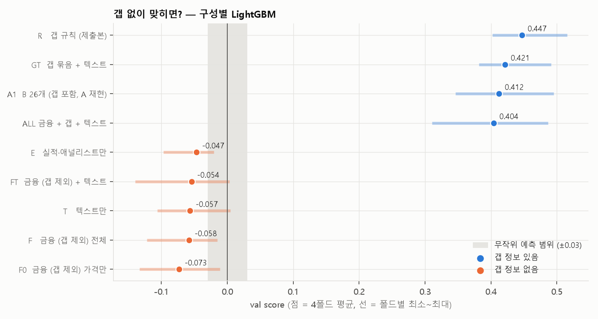

# 갭 없이 맞히면? — 금융·텍스트 구성별 LightGBM

> 시간외 가격에서 나온 피처(갭, 출렁임, 장전·장후 움직임 등 18개)를 **전부 빼고**, 나머지 금융 데이터와 텍스트 데이터만으로 여러 구성을 LightGBM 으로 돌렸습니다.
> "갭 말고 다른 데이터에는 정보가 얼마나 있나"를 보는 실험입니다. 구성은 실행 전에 고정했습니다.

작성 2026-10-08 · 민영(B) · 코드: [nogap/nogap.py](../../work/b/review/nogap/nogap.py) · 재현 방법은 맨 아래

---

## 3줄 요약

1. **갭을 빼면 어떤 조합도 무작위보다 못합니다.** 금융·텍스트·실적·애널리스트, 그리고 그 조합 5가지가 모두 **−0.05 ~ −0.07** 입니다 (무작위 예측은 0 ± 0.03).
2. **갭을 빼면 방향을 못 맞힙니다.** 방향 적중률이 48~50% 로 동전 던지기 수준입니다 (갭 규칙은 68%).
3. **갭에 다른 걸 더하면 오히려 내려갑니다.** 갭 규칙 0.447 > 갭 + 텍스트 0.421 > B 26개 0.412 > 전부 91개 0.404.

---

## 결과

| 구성 | 피처 수 | fold1 | fold2 | fold3 | fold4 | **4폴드 평균** | 처음 보는 종목 | 방향 적중 | 급등락 포착 |
|---|---:|---:|---:|---:|---:|---:|---:|---:|---:|
| **R 갭 규칙 (제출본)** | 2 | 0.434 | 0.436 | 0.402 | 0.515 | **0.447** | 0.363 | **68%** | 62% |
| GT 갭 + 텍스트 | 37 | 0.415 | 0.382 | 0.397 | 0.491 | 0.421 | 0.329 | 68% | 51% |
| A1 B 26개 (갭 포함) | 26 | 0.346 | 0.415 | 0.392 | 0.495 | 0.412 | 0.326 | 65% | 53% |
| ALL 금융 + 갭 + 텍스트 | 91 | 0.311 | 0.415 | 0.404 | 0.487 | 0.404 | 0.307 | 64% | 58% |
| E 실적·애널리스트만 | 17 | −0.020 | −0.027 | −0.097 | −0.043 | **−0.047** | −0.031 | 50% | 44% |
| FT 금융 (갭 제외) + 텍스트 | 73 | −0.011 | −0.140 | 0.004 | −0.070 | **−0.054** | 0.001 | 48% | 36% |
| T 텍스트만 | 19 | −0.043 | −0.106 | −0.082 | 0.005 | **−0.057** | −0.064 | 49% | 31% |
| F 금융 (갭 제외) 전체 | 54 | −0.015 | −0.122 | −0.017 | −0.079 | **−0.058** | −0.006 | 48% | 47% |
| F0 금융 (갭 제외) 가격만 | 37 | −0.025 | −0.133 | −0.011 | −0.123 | **−0.073** | −0.028 | 48% | 37% |

방향 적중 = 보합이 아닌 예측·정답에서 부호가 같은 비율. 급등락 포착 = 정답 급등락 중 급등락으로 찍은 비율. A1 의 fold4 0.495 는 A 결과(0.495)와 같아 절차가 재현됨.

---

## 해석

**왜 갭 없이는 마이너스인가**
- 갭이 없으면 방향 정보가 없습니다 (방향 적중 48~50%). 그런데 점수식은 급등락을 정반대로 찍으면 크게 깎습니다 (A 발표 9장 "크게 찍기의 비대칭").
- LightGBM 은 train 의 일부 구간에서 고른 공격성(k)으로 급등락을 30~40% 찍는데, 방향을 모르니 그 절반이 반대로 틀려서 **무작위보다 못한** 점수가 됩니다.
- 방향 정보가 없을 때 가장 좋은 전략은 "전부 보합"(0점)입니다. 즉 **갭 외의 정보로는 0점을 넘을 방법이 없었습니다.**

**금융·텍스트 데이터는 쓸모가 없나?** 크기는 조금 압니다.
- 실적·애널리스트만으로도 급등락 포착 44%, 금융 전체로 47% 입니다 (실적일·변동성이 큰 날 크게 움직임).
- 하지만 크기만 알고 방향을 모르면 점수식에서는 손해입니다. 그래서 갭과 같이 넣어도 오르지 않고, 오히려 흔들림만 커집니다 (ALL 의 fold1 0.311).

**피처를 늘릴수록 내려감** (갭이 있는 구성끼리): 2개 0.447 → 26개 0.412 → 37개 0.421 → 91개 0.404. 정보는 갭에 다 있고, 나머지는 과적합 재료가 됩니다 (B 문서 4절 "여러 개를 넣으면 무너짐"과 같음).

---

## 발표에 쓸 문장

> "갭을 빼고 다른 금융·텍스트 피처 73개를 다 넣어도 점수는 무작위보다 낮았다(−0.05). 방향 적중률이 50% 로, 9시에 방향을 알려주는 정보는 사실상 시간외 갭뿐이다. 그래서 단순한 갭 규칙이 최선에 가깝다."

- 03·05~07 문서의 "텍스트는 크기만 안다", "갭이 이미 반영" 결론을 **한 장의 그림**(위 그림)으로 보여줄 수 있습니다.
- 강의 연결: w5-1 p25·p27 (Antweiler & Frank, Kogan — 텍스트는 방향보다 변동성)

---

구성에 들어간 피처

- **시간외 (뺀 것, 18개):** gap, gap_z, abs_gap_z, gap_rel_z, mkt_gap, mkt_gap_z, pre_move, post_ret, post_n, pre_n, ext_n, ext_range_z, mkt_absgap, gap_disp, gap_onz, gap_rank, pre_late, ext_pos
- **가격 (37개):** 수익률(1·5·20일, z), 변동성(5·20·60일, atr14, range1), 전날 시가 갭(일봉)·장중 움직임·마지막 1시간(정규장), 거래량 비율, 이동평균 거리, RSI, 볼린저, MACD, 급등락 빈도, 연속 상승일, 60일 위치, 시장 수익률·변동성, 시장 대비 수익률, 베타, 달력(쉰 날 수, 요일)
- **실적·애널리스트 (17개):** 밤사이 실적 발표·서프라이즈, 지난 실적, 실적 이후 일수, 서프라이즈 평균, 실적 시각, 애널리스트 의견 상향·하향·목표가 변화(30일, 밤사이)
- **텍스트 (19개):** 태그 기사 수, 기업명 기사 수, LLM 관련·기대 비교 기사 있음, 뉴스 논조 평균·흩어짐, 출처 수, 새 제목 비율, 09:00~09:30 기사 수·논조, LLM 상회−하회·가이던스·규제·인수합병·의혹, Reddit 의견·글 수·질문·불확실성

재현 방법

- 실행: `uv run python work/b/review/nogap/nogap.py` (15분 안팎)
- 준비 (git 무시 폴더): `cache/b_v2.parquet`, `cache/llm_news_v6/` (채민 뉴스 공백 보정본), `cache/llm_reddit_v4/`
- 모델 절차: `rest/rest.py` 의 `lgb_fit` (A `work/a/lgb.py` 와 같은 파라미터·조기 종료·공격성 k 디코딩)
- 결과 CSV: `nogap/out/` (git 에 안 올림)

