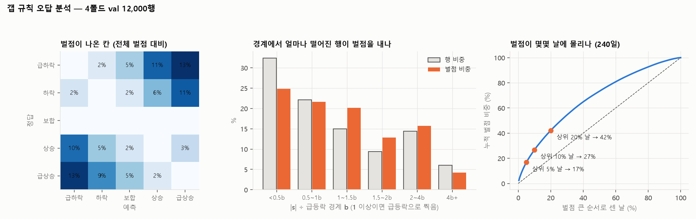

# 갭 규칙 오답 분석 — 어디서 틀리나

> 제출 규칙으로 4폴드 val 을 예측한 12,000행을 합쳐, **벌점이 어느 칸·어느 행·어느 날에서 나오는지** 분석했습니다.
> A 발표 8장(fold4 만)을 4폴드로 넓히고 더 쪼갠 것입니다. 사후 분석이라 규칙은 고치지 않았습니다.

작성 2026-10-08 · 민영(B) · 코드: [errors/errors.py](../../work/b/review/errors/errors.py) · 4폴드 합친 score 0.454

---

## 3줄 요약

1. **벌점의 77% 가 방향을 틀린 데서 나옵니다.** 세기만 틀린 건(상승 → 급상승 등) 6%, 급등락을 보합으로 놓친 건 10% 입니다.
2. **급등락을 정반대로 찍은 2.7% 행이 벌점의 45%** 이고, 그 행들은 **아침에는 평범했습니다** (갭 크기 보통, 경계 근처). 장중에 크게 뒤집힌 날이고, 그날 **시장 전체가 갭과 반대로 간 경우가 58%** 입니다 (맞힌 급등락은 36%).
3. **벌점은 몇몇 날에 몰립니다.** 240일 중 상위 10% 날(24일)이 벌점의 27%. 가장 큰 날은 2025-11-20, 2025-10-10 처럼 시장 전체가 장중에 뒤집힌 날입니다.

---

## 1. 어떤 오답이 벌점을 내나

**칸별 (정답 → 예측), 벌점 큰 순**

| 정답 → 예측 | 행 수 | 벌점 비중 | 누적 |
|---|---:|---:|---:|
| 급하락 → 급상승 | 70 | 13.2% | 13% |
| 급상승 → 급하락 | 68 | 12.8% | 26% |
| 하락 → 급상승 | 416 | 11.0% | 37% |
| 급하락 → 상승 | 101 | 10.7% | 48% |
| 상승 → 급하락 | 385 | 10.2% | 58% |
| 급상승 → 하락 | 81 | 8.6% | 67% |
| 하락 → 상승 | 502 | 5.9% | 72% |
| 상승 → 하락 | 424 | 5.0% | 77% |
| 급상승 → 보합 · 급하락 → 보합 | 203 | 9.5% | 87% |
| 상승 → 급상승 · 하락 → 급하락 (세기만 틀림) | 1,920 | 5.6% | 93% |

- **방향을 틀린 칸 8개가 77%.** 세기만 틀린 칸은 행이 1,920개로 많지만 벌점은 6% 뿐입니다 (벌점 1).
- **"하락인데 급상승", "상승인데 급하락"** (801행, 21%) 은 규칙이 급등락을 넓게 찍어서 생기는 비용입니다. 경계 b 가 낮아 행의 약 40% 를 급등락으로 찍기 때문인데, train 에서는 이게 점수가 가장 높았습니다 (맞았을 때 벌점이 크게 줄고 분모도 같이 커지는 점수식 구조).

**오답 종류로 묶으면**

| 종류 | 행 비중 | 벌점 비중 |
|---|---:|---:|
| ① 급등락을 정반대로 | 2.7% | **45%** |
| ② 급등락을 보합으로 놓침 | 1.7% | 10% |
| ③ 급등락을 한 칸 약하게 | 2.5% | 4% |
| ④ 급등락 아닌 날의 오답 | 41% | 42% |
| 벌점 없음 | 52% | 0% |

## 2. 어떤 행에서 많이 틀리나

집중도 = 벌점 비중 ÷ 행 비중. 1 보다 크면 그 그룹이 제 몫보다 많이 틀림.

| 기준 | 많이 틀리는 그룹 | 집중도 | 덜 틀리는 그룹 | 집중도 |
|---|---|---:|---|---:|
| 갭 크기 \|gap_z\| | 0.25~0.5 | 1.29 | 2 이상 (score 0.97) | 0.28 |
| 급등락 경계와 거리 | **b 를 갓 넘은 행 (1~2b)** | **1.34~1.36** | 4b 이상 | 0.70 |
| 종목 변동성 vol20 | **가장 높은 5분위** (정반대 5.5%) | **1.55** | 가장 낮은 5분위 | 0.65 |
| 실적 발표 밤 | 있음 (정반대 5.1%, score 는 0.81) | 1.42 | 없음 | 0.99 |
| 처음 보는 종목 | 처음 보는 10 | 1.15 | 학습한 40 | 0.96 |
| 뉴스 | 기업명 기사 있음 | 1.08 | 기사 없음 | 0.72 |
| 갭 방향 | 위·아래 거의 같음 (정반대 2.7% 씩) | | | |

- **갭이 아주 크면 거의 안 틀립니다** (|gap_z| ≥ 2: score 0.97). 문제는 **갭이 애매한 크기(0.25~1)에서 급등락으로 찍힌 행**입니다.
- **변동성이 큰 종목**일수록 장중에 갭과 반대로 크게 움직일 여지가 커서 정반대 오답이 많습니다.
- 요일별로 목요일이 높게 나오지만(1.28) 특정 날 몇 개 때문이라 의미를 두지 않습니다.

## 3. 어떤 날에 몰리나

| 벌점 큰 순서 | 날 수 | 벌점 비중 |
|---|---:|---:|
| 상위 5% | 12일 | 17% |
| 상위 10% | 24일 | 27% |
| 상위 20% | 48일 | 42% |

**벌점이 가장 큰 날**

| 대상일 | 벌점 | 정반대 오답 행 | 시장 평균 gap_z | 시장 평균 09:00 이후 움직임 |
|---|---:|---:|---:|---:|
| 2025-11-20 | 836 | 13 | +0.23 | −2.1% |
| 2025-10-10 | 661 | 13 | +0.09 | −2.2% |
| 2026-04-13 | 531 | 8 | −0.06 | +1.5% |
| 2026-01-21 | 493 | 7 | −0.22 | +1.6% |

- 상위 두 날은 아침에 시장 전체가 올라 있었는데 **장중에 시장 전체가 −2% 넘게 뒤집힌 날**입니다. 50종목 중 13개를 정반대로 찍었습니다.
- 상위 10% 날 중 시장 평균이 갭과 반대로 간 날은 54% (전체 날 47%).
- 05 문서 ②에서 확인했듯 **이런 날을 아침 뉴스·Reddit 양으로 미리 알 수는 없었습니다.**

## 4. 정반대로 찍은 행은 아침에 어땠나

| | ① 정반대 오답 | 맞힌 급등락 | 전체 |
|---|---:|---:|---:|
| \|gap_z\| 중앙값 | **0.22** | 0.60 | 0.20 |
| \|s\| ÷ 경계 b | **0.90** (경계 근처) | 2.52 | 0.87 |
| vol20 중앙값 | **2.05%** | 2.19% | 1.58% |
| 실적 발표 밤 | 3.1% | 12.1% | 1.6% |
| 그날 시장 전체가 갭과 반대로 감 | **58%** | 36% | 47% |
| 09:00 이후 \|움직임\| ÷ vol20 | **1.93** | 1.11 | 0.56 |

- 정반대 오답은 **갭이 평범한 크기이고 경계 근처**에서 찍혔습니다 (A 발표 8장 "갭이 작아서 틀린 게 아니다"와 같음).
- 대신 **09:00 이후 평소의 2배 가까이 움직였고**, 그날 시장도 같이 뒤집힌 경우가 많습니다. 즉 **아침 정보로는 알 수 없는 장중 사건** 때문입니다.

## 5. 놓친 급등락

- 실제 급등락 1,755행 중 **39% 는 갭이 거의 없었습니다** (|gap_z| < 0.25). 그중 규칙이 급등락으로 찍은 건 5% 뿐입니다.
- 9시 이후에 생긴 움직임이라 갭 규칙으로는 원래 잡을 수 없는 부분입니다.

---

## 정리: 고칠 수 있는 오답 vs 없는 오답

| 오답 | 벌점 비중 | 고칠 수 있나 |
|---|---:|---|
| 시장 전체가 장중에 뒤집힌 날의 정반대 오답 | ① 의 절반 이상 | ❌ 아침 정보로 예측 불가 (05 문서 ②) |
| 급등락을 보합·한 칸 약하게 찍음 (대부분 갭이 작았던 날) | 약 13% | ❌ 9시 이후 생긴 움직임 |
| 갭이 애매한데 급등락으로 찍어 반대로 틀림 | ①·④ 의 일부 | 🟡 경계를 높이면 줄지만 맞힌 급등락도 줄어듦. train 이 이미 최적으로 고른 경계라, 손대면 점수가 내려감 (A 발표 9장, 06 문서) |
| 변동성 큰 종목의 정반대 오답 | 집중도 1.55 | 🟡 이미 gap_z 가 vol20 으로 나눠 반영. 06 · 07 에서 변동성으로 경계를 옮기는 실험은 효과 없었음 |

**결론:** 큰 벌점은 대부분 **아침 9시에는 알 수 없는 장중 반전**에서 나옵니다. 남은 오답을 줄이려면 9시 이후 정보가 필요해서, 지금 과제 조건에서는 갭 규칙이 할 수 있는 만큼 하고 있다고 볼 수 있습니다.

**다음 데이터에서 검증할 후보 (지금은 채택 안 함):** 변동성 상위 종목에서만 급등락 경계를 높이기 (07 문서의 "갭 크기 × 실적 기사"와 같은 사후 아이디어라 새 데이터로만)

---

## 발표에 쓸 문장

> "갭 규칙 벌점의 77% 는 방향을 틀린 데서 나왔고, 그 절반은 행의 3% 인 '급등락을 정반대로 찍은' 경우였다. 이 행들은 아침에는 평범한 갭이었지만 장중에 평소의 2배로 반대로 움직였고, 절반 이상이 시장 전체가 장중에 뒤집힌 날이었다. 9시 정보로는 알 수 없는 오답이다."

---

재현 방법

- 실행: `uv run python work/b/review/errors/errors.py` (몇 분)
- 폴드마다 train 으로 학습한 규칙으로 그 폴드 val 을 예측한 뒤 4폴드를 합침 (val 기간은 겹치지 않음)
- 행 벌점 = 점수식의 가중치 W[정답, 예측]. 벌점 비중 = 점수식 분자 Σw·O 에서 차지하는 비율
- 결과 CSV: `errors/out/` (`groups.csv`, `days.csv`, `profile.csv`, `cells.csv`, git 에 안 올림)

