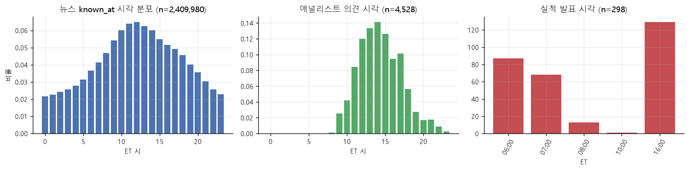
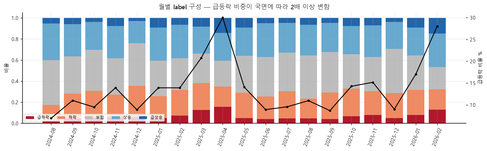
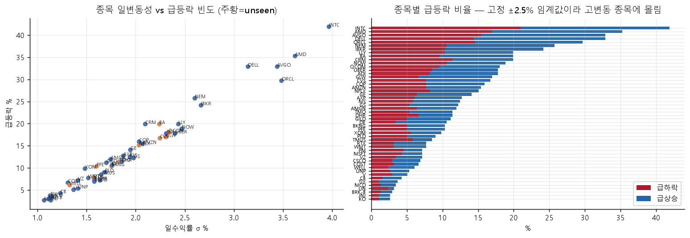
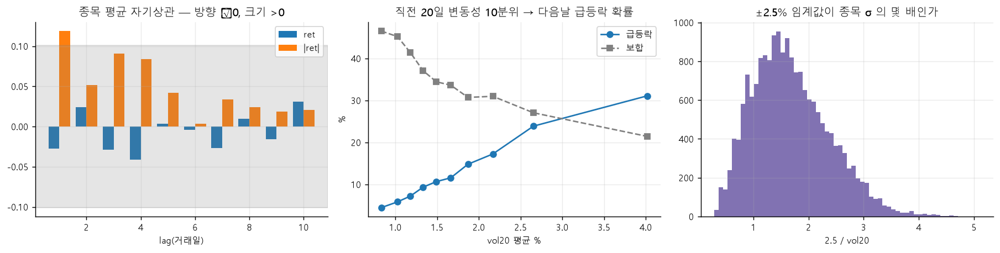
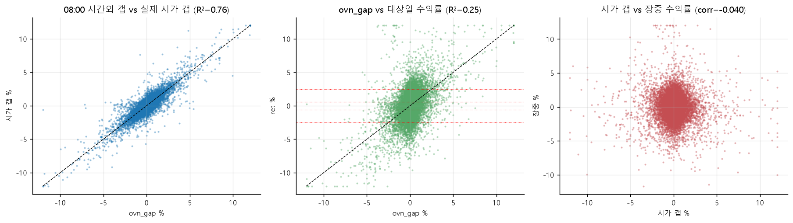
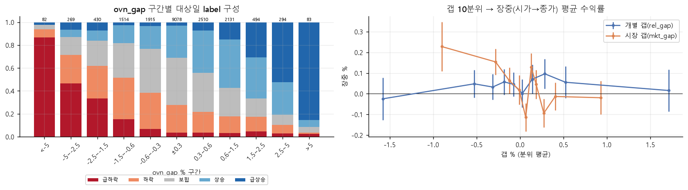
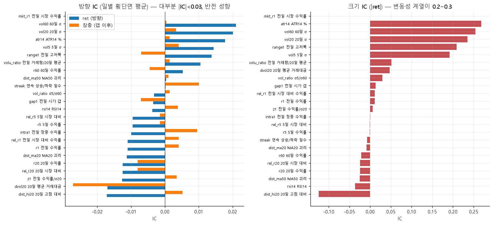
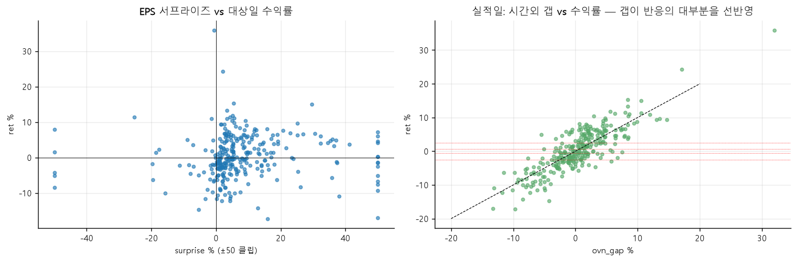
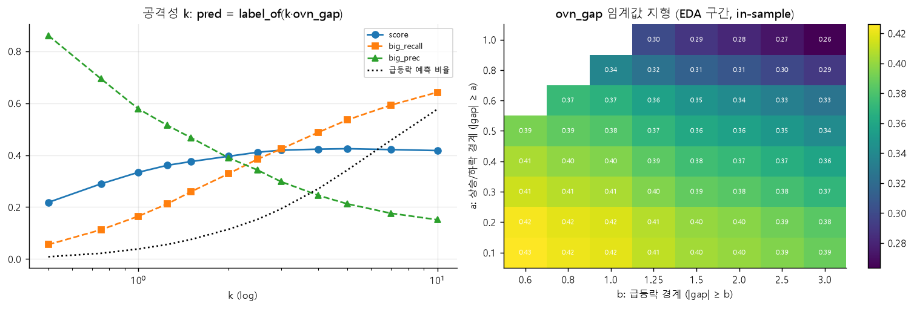

# 2026-10-01 — EDA: 무엇이 다음 날 급등락을 만드는가

작성: 남재은 · 브랜치 `jaeeun-eda`
코드와 산출물: [eda/](../../eda/README.md) · 재현: `uv run python -m eda.run_all`
그림으로 먼저 보기: **[그림 설명 페이지 안내](../explainer/README.md)** (온라인 https://claude.ai/artifact/XRN3c3LHtuXE6mAXvepUfg, 저장소 사본 `docs/explainer/overnight_gap.html`)  
용어 부록: **[docs/glossary.md](../glossary.md)** — 본문의 용어 링크를 누르면 해당 설명으로 갑니다.

> **이 문서를 읽기 전에**
> 과제가 무엇인지는 [과제 개요](../project_overview.md), 데이터를 어떻게 나눴는지는
> [이전 worklog (데이터 분리·폴드·누수 검사)](2026-10-01_2019_데이터분리_폴드_누수검사_기준선.md) 에 있습니다.
> 주식을 처음 접한다면 부록의 [A. 주식 시장의 기본](../glossary.md#a-주식-시장의-기본) 과
> [B. 가격 데이터](../glossary.md#b-가격-데이터) 를 먼저 5분 정도 읽어 두면 본문이 훨씬 쉽습니다.

**목차**

- [0. 요약 — 결론 7개](#0-요약--결론-7개)
- [읽는 법 — EDA 가 무엇을 하는가](#읽는-법--eda-가-무엇을-하는가)
- [숫자의 출처 — 모델이 아니라 규칙과 통계](#숫자의-출처--모델이-아니라-규칙과-통계)
- [1. 데이터 감사 — 믿고 써도 되나](#1-데이터-감사--믿고-써도-되나)
- [2. 정답(label)의 성질 — 점수는 어디서 결정되나](#2-정답label의-성질--점수는-어디서-결정되나)
- [3. 시간외 갭 — 이 과제의 핵심](#3-시간외-갭--이-과제의-핵심)
- [4. 기술적 지표 — 방향은 잡음, 크기는 신호](#4-기술적-지표--방향은-잡음-크기는-신호)
- [5. 이벤트와 텍스트 — 실적·애널리스트·뉴스·Reddit](#5-이벤트와-텍스트--실적애널리스트뉴스reddit)
- [6. 점수식의 의사결정 구조](#6-점수식의-의사결정-구조)
- [7. 피처 우선순위와 모델 구조 제안](#7-피처-우선순위와-모델-구조-제안)
- [8. 확인: 폴드 CV](#8-확인-폴드-cv)
- [9. 한계와 주의](#9-한계와-주의)

---

## 0. 요약 — 결론 7개

한 문장으로: **"오를지 내릴지"는 개장 전 시간외 가격이 거의 유일한 단서이고, "얼마나 크게 움직일지"는 여러 곳에서 예측할 수 있다.**

| # | 발견 | 쉽게 말하면 | 모델에 주는 의미 |
|---|---|---|---|
| 1 | **전일 종가 → 개장 전 시간외 가격의 [갭](../glossary.md#갭-gap)(`ovn_gap`)이 압도적 1순위 신호** | 밤사이 시간외 거래에서 이미 3% 올라 있으면, 그날 종가도 오를 가능성이 매우 높음 | 기존 기준선은 이 갭을 반쪽만 쟀음. **재는 방법만 바꿔도 연습 시험 점수 0.233 → 0.433** (피처 하나짜리 규칙, [숫자의 출처 ④](#숫자의-출처--모델이-아니라-규칙과-통계)) |
| 2 | 방향은 갭 말고는 거의 예측 불가 | 최근에 올랐는지, [RSI](../glossary.md#rsi-상대강도지수) 가 높은지 같은 차트 지표로는 내일 방향을 못 맞힘 | 차트 지표로 방향을 맞히려 하지 말 것 |
| 3 | **크기(급등락 여부)는 예측 가능** | 최근에 많이 출렁인 종목은 내일도 크게 움직이기 쉬움 ([변동성 군집](../glossary.md#변동성-군집-volatility-clustering)) | "방향은 갭, 세기는 변동성" 으로 나눠 설계 |
| 4 | 급등락은 **변동성이 큰 종목에 몰림** | 급등락 기준이 모든 종목에 똑같이 ±2.5% 라서, 원래 많이 출렁이는 반도체주가 급등락을 독차지함 | 종목 이름 대신 [변동성(σ)](../glossary.md#변동성-표준편차-σ) 으로 표현하면 처음 보는 종목에도 통함 |
| 5 | **[실적 발표](../glossary.md#실적-발표-어닝-시즌)일은 별개의 세계** | 실적 발표 다음 날은 64% 가 급등락 (평소 13%) | 실적 여부와 다음 발표까지 남은 기간이 필수 피처 |
| 6 | 뉴스·Reddit 은 크기 보조 신호, 방향 정보는 없음 | 기사가 많이 쏟아진 종목은 크게 움직이지만, 기사 논조로 방향은 못 맞힘. Reddit 은 쓸모없음 | LLM 비용은 "방향 분류"보다 "큰 사건 기사 탐지"에 |
| 7 | 점수식은 **애매하면 센 쪽으로 찍는 게 유리** | 정답이 보합인 날은 무엇을 찍어도 벌점 0 이라, 급등락을 넉넉히 찍어도 손해가 적음 | 보합 예측은 거의 쓰지 말고 결정 경계를 따로 조정 |

---

## 읽는 법 — EDA 가 무엇을 하는가

**EDA (탐색적 데이터 분석)** 는 모델을 만들기 전에 데이터를 이리저리 살펴보며 "무엇이 예측에 도움이 될지" 가설을 세우는 단계입니다.
이 문서는 실제 투자 분석가가 새 데이터를 받았을 때 보는 순서를 따릅니다.

1. **데이터를 믿어도 되나** ([§1](#1-데이터-감사--믿고-써도-되나)) — 숫자가 틀리면 아무리 좋은 모델도 소용없음
2. **맞혀야 할 정답은 어떻게 생겼나** ([§2](#2-정답label의-성질--점수는-어디서-결정되나)) — 점수가 어디서 결정되는지 알아야 어디에 힘을 쓸지 정함
3. **어떤 정보가 정답을 예고하나** ([§3](#3-시간외-갭--이-과제의-핵심)~[§5](#5-이벤트와-텍스트--실적애널리스트뉴스reddit)) — 가격, 차트 지표, 기업 이벤트, 뉴스를 하나씩 확인
4. **점수식에 맞게 어떻게 찍어야 하나** ([§6](#6-점수식의-의사결정-구조))
5. **결론을 다른 기간에서도 확인** ([§8](#8-확인-폴드-cv))

**사용한 데이터 기간.** 팀 규칙대로 [fold4 의 학습 구간](../glossary.md#폴드-교차검증-cv-walk-forward)
(대상일 2024-08-14 ~ 2026-02-13, 376거래일 × 50종목 = 18,850행) 만 봤습니다.
검증 기간 데이터를 보고 피처를 고르면 연습 점수가 실제보다 좋게 나오기 때문입니다 ([이유](2026-10-01_2019_데이터분리_폴드_누수검사_기준선.md#3-공유한-zip-파일-두-개)).
코드가 `lab/folds.json` 을 읽어 그 이후 데이터는 아예 읽지 않습니다. 마지막 [§8](#8-확인-폴드-cv) 만 팀이 정한 검증 절차로 검증 기간 점수를 봤습니다.

**자주 나오는 숫자 읽는 법.** 자세한 설명은 부록 [G. 통계 도구](../glossary.md#g-통계-도구) 에 있습니다.

| 숫자 | 뜻 | 어느 정도면 의미 있나 |
|---|---|---|
| [IC](../glossary.md#ic-information-coefficient-정보계수) | 하루마다 50종목에서 "피처가 큰 종목일수록 다음 날 수익률도 큰가"를 잰 상관의 평균 (−1 ~ 1) | 주식에서 0.02~0.05 면 쓸 만함, 0.1 이상이면 매우 강함 |
| [t값](../glossary.md#t값-유의성) | 결과가 우연이 아닐 가능성 | \|t\| > 2 면 우연이라 보기 어려움 |
| [AUC](../glossary.md#auc) | 급등락한 날과 아닌 날을 얼마나 잘 가르나 (0.5 ~ 1) | 0.5 는 구별 못 함, 0.7 이면 꽤 구별함 |
| [R²](../glossary.md#r²-결정계수) | 한 값이 다른 값의 변화를 몇 % 설명하나 | 1 이면 완벽히 설명 |
| [score](../glossary.md#score-가중-벌점-점수) | 과제 채점 점수 | 0 이 무작위, 1 이 완벽 |

---

## 숫자의 출처 — 모델이 아니라 규칙과 통계

이 보고서에서 **머신러닝 모델은 하나도 학습하지 않았습니다.** 나오는 숫자는 아래 네 종류 중 하나이고, 성격이 서로 다릅니다.
"정확도"처럼 읽으면 오해하기 쉬우니, 숫자를 볼 때 어느 종류인지 먼저 확인해 주세요.

| 종류 | 대표 숫자 | 쓴 피처 | 학습·튜닝 | 어느 데이터에서 잼 | 나오는 곳 |
|---|---|---|---|---|---|
| ① 통계 (모델 없음) | "하루 움직임의 약 30%", IC 0.30, R² 0.76, AUC | 피처 하나와 정답의 관계를 직접 계산 | 없음 | EDA 구간 | §2~§5 |
| ② 규칙 A: 그대로 대입 | score **0.334** | `ovn_gap` 하나 | 없음 | EDA 구간 | §3.2 |
| ③ 규칙 B: 경계 탐색 | score **0.426** | `ovn_gap` 하나 | 경계 2개를 EDA 구간 전체에서 고름 (in-sample) | EDA 구간 | §6 |
| ④ 규칙 C: 폴드 CV | score **0.433** (기존 정의 0.233) | `ovn_gap` 하나 (비교군은 `pre_move` 하나) | 경계 2개를 폴드마다 학습 기간에서만 고름 | 각 폴드의 검증 기간 | §8 |

### ① "약 30%"는 맞힌 비율이 아니다

"30% 를 맞힌다"는 뜻이 아닙니다. **정답(대상일 수익률)이 날마다 다른 정도(분산) 가운데, 09:30 전에 이미 가격으로 드러나 있는 몫이 약 30%** 라는 뜻입니다.
모델 없이 두 숫자를 곱했습니다.

```
① 하루 수익률 분산 중 밤사이(전일 종가→시가) 움직임의 몫      = Var(시가 갭) / Var(수익률) = 0.39
② 09:00 시간외 가격(ovn_gap)이 그 밤사이 움직임을 설명하는 정도 = R²(ovn_gap → 시가 갭)  = 0.76
③ 0.39 × 0.76 ≈ 0.30
```

여기서 시가는 "얼마나 미리 보였나"를 사후에 재는 데에만 썼고 예측에는 쓰지 않습니다 ([갭](../glossary.md#갭-gap)).
시가 갭과 장중 움직임의 분산 몫(0.39 + 0.66)이 정확히 1 이 아니라서 30% 는 대략적인 크기로만 보면 됩니다.
직접 재면 `ovn_gap` 하나가 대상일 수익률 분산을 설명하는 정도는 R² 0.25 입니다 ([§3.1](#31-하루-움직임의-몇-가-개장-전에-이미-보이나)).

### ② 규칙 A — 갭을 그대로 label 경계에 대입 (score 0.334)

"오늘 종가 수익률이 밤사이 갭과 같을 것"이라고 가정하고, 정답을 나눌 때 쓰는 경계(±0.6%, ±2.5%)를 갭에 그대로 씁니다.

```python
pred = label_of(ovn_gap)     # src.data.label_of, 정답 label 을 만드는 함수와 같음
# ovn_gap < -2.5 → 0 급하락,  -2.5~-0.6 → 1 하락,  -0.6~+0.6 → 2 보합,
#            +0.6~+2.5 → 3 상승,   > +2.5 → 4 급상승
```

학습도 튜닝도 없어서, 신호 자체의 힘을 보는 "원석" 점수입니다. 같은 방식으로 다른 갭 정의도 쟀습니다 (`pre_move` 0.132 등, [§3.2](#32-갭을-어떻게-재느냐가-결정적)).
코드: `eda/s03_overnight_gap.py` 의 `naive_mapping`.

### ③ 규칙 B — 경계 두 개를 고름 (score 0.426, in-sample)

규칙 A 의 경계(0.6, 2.5)가 최선인지 보려고, 대칭 경계 a(상승·하락 경계), b(급등락 경계)를 바꿔 가며 EDA 구간 전체 점수를 쟀습니다.

```python
def cut(g, a, b):            # |g| < a → 보합,  a ≤ |g| < b → 상승/하락,  |g| ≥ b → 급등락
    ...
a ∈ {0.1, 0.2, ..., 1.0},  b ∈ {0.6, 0.8, ..., 3.0}   →  최고: a=0.1, b=0.6, score 0.426
```

점수를 잰 데이터에서 경계를 골랐으므로 **in-sample** 값이고, 실제 성능보다 좋게 나올 수 있습니다 ([in-sample](../glossary.md#in-sample-out-of-sample-과적합)).
"보합을 거의 안 찍는 쪽이 유리하다"는 점수식의 성질을 보이려는 실험이지 성능 주장이 아닙니다. 코드: `eda/s06_metric_unseen.py`.

### ④ 규칙 C — 폴드 CV (score 0.433) ← 새 기준선

규칙 B 를 공정하게 잰 것입니다. 팀 [기준선](../glossary.md#기준선-baseline) `lab/baselines.py` 의 `fit_gap` 과 **같은 절차**에 갭 정의만 바꿨습니다.

```
폴드마다:
  1. 학습 기간 날짜마다 build_ovn_gap(day) 로 50종목 갭을 계산 (day API 로만 꺼내서 누수 없음)
  2. unseen 10종목은 학습에서 뺌
  3. |갭| 의 분위수 13개(10%, 20%, ..., 99%)를 후보로, a < b 인 모든 쌍에 대해 학습 기간 score 계산 → 최고인 (a, b) 선택
  4. 검증 기간 60일을 그 (a, b) 로 예측해 채점 (all / seen / unseen)
4개 폴드 평균 = 0.433
```

- **피처:** `ovn_gap` 하나뿐입니다. 변동성·실적·뉴스는 넣지 않았습니다. 그것들은 [§7](#7-피처-우선순위와-모델-구조-제안) 에서 모델에 넣을 후보로 제안만 했습니다.
- **비교군 0.233:** 기존 기준선의 `pre_move`(프리마켓 첫 봉 → 마지막 봉)를 같은 13개 후보로 돌린 값입니다.
  README 의 0.204 는 원래 코드의 후보 9개(50%~99% 분위)로 낸 값입니다. 후보 범위를 맞춰야 갭 정의 차이만 비교되므로 넓혀서 다시 돌렸습니다.
- **"등락을 그대로 가져온 것"과의 차이:** 규칙 A 가 갭을 그대로 가져온 것이고, 규칙 C 는 경계를 학습 기간에서 따로 고른다는 점만 다릅니다.
  둘 다 "갭이 오른 방향이면 오른 쪽 label" 이라는 방향 규칙은 같습니다.
- 코드: `eda/cv_check_ovn_gap.py`. 결과 표: [tab_cv_gap_definitions.csv](../../eda/out/cv_ovn_gap/tab_cv_gap_definitions.csv).

그러니 0.433 은 **"피처 하나에 경계 두 개짜리 규칙"의 점수**이고, 앞으로 만들 모델(여러 피처 + LightGBM)이 넘어야 할 바닥입니다.

---

## 1. 데이터 감사 — 믿고 써도 되나

**왜 보나.** 금융 데이터는 수집 오류, 빠진 날, [액면분할](../glossary.md#액면분할) 미반영 같은 함정이 흔합니다.
그리고 이 과제는 "09:30 전에 알 수 있었던 정보만" 써야 하므로, 각 데이터가 **언제 들어오는지**를 정확히 알아야 합니다 ([누수](../glossary.md#누수-leakage-known_at-cutoff)).

산출물: [eda/out/s01_data_audit/](../../eda/out/s01_data_audit/)

| 확인한 것 | 결과 | 의미 |
|---|---|---|
| 종목별 [일봉](../glossary.md#봉-일봉-시간봉) 일수 | 50종목 모두 376일, 빠진 날 0 | 결측 처리 필요 없음 |
| [수익률](../glossary.md#수익률-등락률) 이 종가/전일 종가로 맞게 계산됐나 | 0.01% 넘게 어긋나는 행 0 | 정답(label) 계산 믿을 수 있음 |
| 시간봉의 마지막 종가 = 일봉 종가? | 완전 일치 | 두 표를 섞어 써도 됨 |
| 하루 ±12% 넘는 움직임 | 34건, **전부 실제 사건** ([2025-04-09 관세 유예 랠리](../glossary.md#2025-04-09-관세-유예-랠리) 9건, 실적 반응, ORCL 2025-09-10 +36% 등) | 지우면 안 됨. 오히려 점수를 좌우하는 날들 |
| [시간외 거래](../glossary.md#시간외-거래-pre--post-세션) 봉의 [거래량](../glossary.md#거래량-거래대금) | **99.99% 가 0 (기록 안 됨)**, 가격은 정상적으로 움직임 | 시간외 거래량 피처는 만들 수 없음. "거래량 0인 봉은 버린다" 같은 처리를 하면 안 됨 |
| 뉴스가 들어오는 시각 | 하루 약 4,900건, **58% 가 장 마감 후 ~ 개장 전** | 밤사이 뉴스가 예측에 쓸 수 있는 정보의 대부분 |
| 실적 발표 시각 | 06:00·07:00 (개장 전) 또는 16:00 (마감 직후) 로 거의 양분 | 실적 반응은 거의 항상 시간외 가격과 다음 날 갭에 먼저 나타남 |

**09:30 에 쓸 수 있는 시간봉은 어디까지인가** ([표](../../eda/out/s01_data_audit/tab_hourly_bar_layout.csv)).
기준일 애프터마켓 16:00~19:00 봉과 대상일 프리마켓 04:00~**08:00** 봉까지입니다.
프리마켓 09:00 봉은 09:00~09:30 구간이라 09:30 에야 닫히므로 **쓸 수 없습니다** ([시간봉 시각의 함정](../glossary.md#시간봉-시각의-함정-0900-봉을-못-쓰는-이유)).
`day.price()` 가 알아서 빼 주므로 따로 처리할 필요는 없습니다. 결국 우리가 볼 수 있는 마지막 가격은 대상일 09:00 무렵 가격입니다.



*그림: 왼쪽부터 뉴스, 애널리스트 의견, 실적 발표가 들어오는 시각(뉴욕 시각). 뉴스는 밤에도 꾸준히, 실적은 개장 전과 마감 직후에 몰립니다.*

**정리:** 데이터 품질은 좋습니다. 주의할 것은 시간외 거래량이 없다는 점 하나입니다.
거래량이 0 인데 왜 가격은 믿을 수 있는지는 [그림 설명 페이지](../explainer/README.md) 장면 3 에 그림으로 풀어 두었습니다.

---

## 2. 정답(label)의 성질 — 점수는 어디서 결정되나

**왜 보나.** 이 과제의 [점수](../glossary.md#score-가중-벌점-점수)는 정답이 보합인 날에는 벌점이 0 이고, 급등락인 날에 가장 무겁습니다.
그러니 **급등락이 누구에게, 언제, 어떻게 일어나는지**를 먼저 알아야 합니다.

산출물: [eda/out/s02_target_returns/](../../eda/out/s02_target_returns/)

### 2.1 분포와 시기별 변화

| 기간 | 급하락 | 하락 | 보합 | 상승 | 급상승 |
|---|---|---|---|---|---|
| EDA 구간 전체 | 6.6% | 23.3% | 34.8% | 28.3% | 7.0% |
| 2024년 하반기 | 5.1 | 23.7 | 38.0 | 28.1 | 5.2 |
| 2025년 상반기 | 8.3 | 22.6 | 31.3 | 29.0 | 8.8 |
| 2025년 하반기 | 5.4 | 23.8 | 37.2 | 27.8 | 5.8 |
| 2026년 (1/2~2/13) | 9.5 | 22.3 | 28.7 | 28.3 | 11.1 |

**읽는 법:** 급등락(급하락+급상승)은 평균 13.6% 지만, 시기에 따라 10% 남짓에서 20% 넘게까지 변합니다.

- **극단적인 날이 생각보다 자주 옵니다.** 평균에서 크게 벗어난 날(3σ 이상)이 [정규분포](../glossary.md#정규분포-두꺼운-꼬리-첨도-qq-plot) 가정보다 **6.8배** 많습니다
  ([첨도](../glossary.md#정규분포-두꺼운-꼬리-첨도-qq-plot) 16.7). "수익률은 종 모양 분포"라고 가정하는 모델은 급등락을 과소평가합니다.
- **월별 급등락 비율은 6.9% (2024-08) ~ 30% (2025-04) 로 4배 넘게 변합니다.** 시장 분위기([국면](../glossary.md#국면-regime))에 따라
  급등락이 올 기본 확률 자체가 달라지므로, 최근 시장이 얼마나 출렁였는지를 피처로 넣어야 합니다.
- 요일 효과는 거의 없습니다 (요일별 급등락 12.5~14.7%). 쓰지 않아도 됩니다.



*그림: 막대는 월별 label 구성, 검은 선은 급등락 비율. 2025년 4월(관세 충격)과 2026년 2월이 두드러집니다.*

### 2.2 누가 급등락하나 — 종목의 변동성이 거의 전부



*그림 왼쪽: 가로축은 종목이 평소 하루에 움직이는 폭([표준편차](../glossary.md#변동성-표준편차-σ)), 세로축은 급등락 빈도. 거의 일직선입니다. 주황 점은 [unseen 종목](../glossary.md#seen--unseen-종목).*

- 종목별 급등락 빈도는 코카콜라(KO)·존슨앤드존슨(JNJ) 2.7% 부터 인텔(INTC) 41.9% 까지입니다. 종목 변동성과의 상관이 **0.985** 입니다.
- 이유는 단순합니다. 급등락 기준이 모든 종목에 똑같이 ±2.5% 이기 때문입니다. 하루 평균 1% 움직이는
  [방어주](../glossary.md#섹터-방어주) 에게 2.5% 는 드문 사건이지만, 하루 평균 4% 움직이는 반도체주에게는 흔한 하루입니다.
  중간 종목 기준으로 ±2.5% 는 평소 움직임의 **1.6배** 입니다.
- 그래서 모델에 "이 종목이 인텔인가"를 알려 주는 대신 **"이 종목의 최근 변동성이 얼마인가"를 알려 주면**,
  처음 보는 종목에서도 똑같이 작동합니다 ([팀 피처 규칙 5](../../README.md#피처-규칙-ai-에-코드-맡길-때도-이-규칙을-같이-붙여-줄-것)).

### 2.3 크기는 이어지고, 방향은 이어지지 않는다

같은 종목에서 오늘과 며칠 전의 관계([자기상관](../glossary.md#자기상관))를 재 봤습니다.

| | 1일 전 | 5일 전 | 10일 전 |
|---|---|---|---|
| 수익률 (방향 포함) | −0.027 | | |
| \|수익률\| (크기만) | **0.119** | 0.042 | 0.021 |

**읽는 법:** 어제 올랐다고 오늘 오른다는 관계는 없습니다(−0.027 ≈ 0). 반면 어제 크게 움직였으면 오늘도 크게 움직이는 경향은 뚜렷합니다(0.119).
이것이 금융에서 잘 알려진 [변동성 군집](../glossary.md#변동성-군집-volatility-clustering) 입니다.

- 직전 20일 변동성으로 종목-날짜를 10개 그룹([10분위](../glossary.md#분위-10분위))으로 나누면,
  다음 날 급등락 확률이 **가장 조용한 그룹 4.5% → 가장 출렁이는 그룹 31.1%** 로 7배 차이 납니다.
- 변동성 피처 하나만으로 급등락 여부를 가르는 능력: [ATR14](../glossary.md#atr-average-true-range-고저폭) AUC 0.713, 60일 변동성 0.690.
- **"어제 label 따라가기" 기준선이 음수 점수인 이유:** 급등락 다음 날 또 급등락할 확률은 24.7% (평소 13.6%) 로 높지만,
  방향은 무작위입니다(급하락 다음 날 급상승 13.4%). 그래서 어제를 따라 찍으면 반대 방향 급등락에 가장 큰 벌점(64)을 맞습니다.



*그림 가운데: 직전 20일 변동성이 클수록(오른쪽) 다음 날 급등락 확률이 오르고 보합 확률이 내려갑니다.*

### 2.4 시장 전체가 같이 움직이는 몫

- 종목 움직임의 약 23~27% 가 [시장 요인](../glossary.md#시장-요인-개별-요인) (50종목 평균 움직임) 으로 설명됩니다. 나머지는 회사별 사정입니다.
- 시장이 하루에 1.5% 넘게 움직인 날은 전체의 7.4% 뿐인데, 급등락의 22.5% 가 이런 날에 나왔습니다.
  급등락이 많았던 상위 5% 날에 전체 급등락의 18% 가 몰려 있습니다. 즉 **급등락은 특정 날에 우르르 옵니다**.
- 종목 간 상관을 그려 보면 [섹터](../glossary.md#섹터-방어주)별로 묶입니다: 반도체(AMD·AVGO·ADI·QCOM·INTC), 금융(GS·MS·AXP·IBKR), 방어주(KO·PM·JNJ·WMT).

**정리:** 급등락은 "변동성 큰 종목에서, 시장이 불안한 시기에, 몰려서" 일어납니다. 이 세 가지는 모두 09:30 이전에 알 수 있는 정보로 표현할 수 있습니다.

---

## 3. 시간외 갭 — 이 과제의 핵심

**왜 보나.** 정답은 "대상일 종가 / 전일 종가"입니다. 이 움직임은 두 부분으로 나뉩니다.

```
전일 종가 ──(밤사이: 시가 갭)──▶ 대상일 시가(09:30) ──(장중)──▶ 대상일 종가(16:00)
```

밤사이 움직임은 [시간외 거래](../glossary.md#시간외-거래-pre--post-세션) 가격에 미리 나타납니다. 09:30 에 예측하는 우리에게 이보다 직접적인 정보는 없습니다.

산출물: [eda/out/s03_overnight_gap/](../../eda/out/s03_overnight_gap/)

### 3.1 하루 움직임의 몇 %가 개장 전에 이미 보이나

| | 값 |
|---|---|
| 하루 움직임(분산) 중 밤사이 [갭](../glossary.md#갭-gap) 의 몫 | **39%** |
| 장중 움직임의 몫 | 66% (두 부분은 서로 거의 무관, 상관 −0.04) |
| 09:00 시간외 가격이 실제 시가 갭을 설명하는 정도 ([R²](../glossary.md#r²-결정계수)) | **0.76** |
| `ovn_gap` 이 대상일 하루 수익률을 설명하는 정도 | 0.25 |
| 급등락한 날 중 이미 시가에서 1.5% 넘게 벌어져 있던 비율 | 38% |

**읽는 법:** 하루 움직임(분산)의 약 30% (39% × 0.76) 는 **개장 전에 이미 가격으로 드러나 있습니다**. 맞힌 비율이 아니라 분산의 몫입니다 ([계산 방법](#숫자의-출처--모델이-아니라-규칙과-통계)).
나머지 장중 움직임은 거의 예측할 수 없는 무작위에 가깝습니다. 그러니 이 30% 를 정확히 잡는 것이 이 과제의 출발점입니다.



*그림 왼쪽: 09:00 시간외 갭(가로)과 실제 시가 갭(세로)이 대각선에 몰려 있습니다. 가운데: 갭과 하루 수익률. 오른쪽: 시가 갭과 장중 수익률은 관계가 없습니다.*

### 3.2 갭을 어떻게 재느냐가 결정적

같은 "개장 전 움직임"이라도 **어디서부터 재느냐**에 따라 정보량이 크게 다릅니다.

```
기준일                                          대상일
 16:00 ┌─애프터마켓─┐   (밤, 거래 없음)   ┌─프리마켓─┐ 09:30
 종가  16:00 ··· 19:00                  04:00 ··· 08:00   개장
  │◀──────────────── ovn_gap ────────────────────────▶│
  │◀─ post_ret ─▶│                      │◀─pre_move─▶│
```

| 정의 | 무엇을 재나 | [IC](../glossary.md#ic-information-coefficient-정보계수) | [t](../glossary.md#t값-유의성) | 급상승 [AUC](../glossary.md#auc) | 급하락 AUC | label 경계에 그대로 대입한 score |
|---|---|---|---|---|---|---|
| **`ovn_gap`** | 전일 종가 → 개장 전 마지막 시간외 가격 | **0.299** | 26.3 | 0.744 | 0.724 | **0.334** |
| `ovn_gap_z` | ovn_gap ÷ 종목 변동성 | 0.283 | 26.6 | 0.724 | 0.719 | |
| `rel_gap` | ovn_gap − 50종목 평균 갭 | 0.299 | 26.3 | 0.726 | 0.679 | |
| `pre_vs_post` | 애프터마켓 마지막 → 프리마켓 마지막 | 0.243 | 22.1 | 0.715 | 0.672 | 0.266 |
| `pre_move` | **프리마켓 첫 봉 → 마지막 봉 (기존 기준선)** | 0.151 | 14.4 | 0.643 | 0.607 | 0.132 |
| `post_ret` | 전일 종가 → 애프터마켓 마지막 | 0.091 | 8.6 | 0.563 | 0.573 | 0.075 |

*마지막 열은 규칙 A: 학습 없이 `label_of(갭)` 으로 찍은 점수 ([숫자의 출처 ②](#숫자의-출처--모델이-아니라-규칙과-통계)).*

**읽는 법:** IC 0.30 은 주식 예측에서 이례적으로 강한 값입니다(보통 0.05 면 좋은 편). t = 26 은 우연일 가능성이 사실상 0 이고,
376일 중 92% 의 날에 IC 가 양수였으며, 반기별로도 0.28~0.32 로 흔들리지 않았습니다.

**기존 기준선이 놓친 것.** 현재 [기준선](../glossary.md#기준선-baseline) (`lab/baselines.py` 의 `build_gap`) 은 **프리마켓 봉끼리만** 비교합니다.
그래서 마감 직후 실적 발표처럼 **애프터마켓에서 터진 움직임과, 밤사이 프리마켓 첫 봉 전까지의 움직임이 통째로 빠집니다.**
기준점을 전일 종가로 바꾸는 것만으로 IC 가 두 배가 됩니다.

### 3.3 갭 크기별로 다음 날 어떻게 됐나



*그림 왼쪽: 갭 크기 구간별 대상일 label 구성. 갭이 클수록 같은 방향 급등락(진한 색)이 늘어납니다. 막대 위 숫자는 건수.*

| 개장 전 갭 | 건수 | 급하락 | 급상승 | 개장 후 장중 평균 |
|---|---|---|---|---|
| −5% 미만 | 82 | **86.6%** | 2.4% | −0.63% |
| −5 ~ −2.5% | 269 | 46.5% | 6.7% | +0.42% |
| −2.5 ~ −1.5% | 430 | 33.3% | 7.4% | +0.62% |
| ±0.3% 이내 | 9,078 | 3.7% | 3.1% | +0.02% |
| +1.5 ~ +2.5% | 494 | 4.7% | 30.8% | −0.24% |
| +2.5 ~ +5% | 294 | 3.1% | 52.4% | −0.39% |
| +5% 초과 | 83 | 2.4% | **85.5%** | −0.51% |

- 갭이 ±5% 를 넘으면 85% 이상이 그 방향 급등락으로 끝납니다.
- 중간 크기 갭(1.5~5%)은 **개장 후 일부 되돌립니다**. 예를 들어 밤사이 2~5% 빠진 종목은 장중에 평균 0.4~0.6% 반등합니다.
  밤사이 과하게 반응했던 것이 정규장에서 조정되는 것으로 볼 수 있습니다 ([반전](../glossary.md#모멘텀과-반전)).
- **시장 전체 갭과 종목만의 갭은 다르게 움직입니다** (그림 오른쪽). 시장 전체가 밤사이 빠진 날은 장중에 평균 +0.23% 되돌리고,
  종목만 빠진 경우는 그대로 유지됩니다. 회사 고유의 소식은 진짜 정보이고, 시장 전체 움직임은 과잉 반응이 섞여 있다는 해석이 가능합니다.
  → 갭을 [시장 몫과 개별 몫](../glossary.md#시장-요인-개별-요인)(`mkt_gap`, `rel_gap`)으로 나눠 넣으면 모델이 이 차이를 배울 수 있습니다.
- 갭이 그 종목 평소 움직임(1σ)보다 크면 종가가 갭 방향으로 끝날 확률이 75~91% 입니다 (작은 갭은 58%).

### 3.4 실적 발표일과 평소의 차이

| | 건수 | 갭이 수익률을 설명하는 정도 (R²) | 평균 갭 크기 | 급등락 비율 | 갭 그대로 찍었을 때 score |
|---|---|---|---|---|---|
| 실적 반응일 | 297 | **0.71** | 3.70% | 64% | 0.786 |
| 평소 | 18,553 | 0.18 | 0.56% | 12.8% | 0.303 |

**읽는 법:** 실적 발표일에는 갭이 하루 움직임의 71% 를 설명합니다. 시장이 실적을 밤사이에 거의 다 반영한다는 뜻입니다.

**정리:** 개장 전 갭은 전일 종가 기준으로 재야 하고, 그것만으로 기존 기준선의 두 배 이상 점수가 나옵니다.

---

## 4. 기술적 지표 — 방향은 잡음, 크기는 신호

**왜 보나.** 투자자들이 흔히 보는 차트 지표([모멘텀](../glossary.md#모멘텀과-반전), [이동평균](../glossary.md#이동평균-ma-이동평균-괴리), [RSI](../glossary.md#rsi-상대강도지수) 등)가
갭 외에 추가 정보를 주는지 확인합니다. 교수님 예제 모델이 이런 지표를 썼습니다.

산출물: [eda/out/s04_technical/](../../eda/out/s04_technical/) · 전체 표 [tab_feature_ic.csv](../../eda/out/s04_technical/tab_feature_ic.csv)

각 지표를 세 가지 질문으로 봤습니다.

- **방향 IC**: 이 지표가 큰 종목이 다음 날 더 오르나?
- **갭 잔차 IC**: 갭이 이미 알려 준 것을 빼고도([잔차](../glossary.md#잔차-통제-부분상관)) 더 알려 주는 게 있나?
- **크기 IC**: 이 지표가 큰 종목이 다음 날 더 크게(방향 무관) 움직이나?

| 지표 | 방향 IC | 갭 잔차 IC | **크기 IC (t)** | 급등락 AUC |
|---|---|---|---|---|
| 전일 수익률 | −0.011 | −0.014 | 0.011 (1.2) | 0.51 |
| 5일 수익률 | −0.010 | −0.012 | −0.001 | 0.54 |
| 20일 수익률 | −0.012 | −0.006 | −0.024 (−2.4) | 0.55 |
| [RSI14](../glossary.md#rsi-상대강도지수) | −0.004 | 0.006 | −0.037 (−3.7) | 0.56 |
| [20일 고점 대비](../glossary.md#20일-고점-대비) | −0.017 | 0.001 | **−0.125 (−13.2)** | 0.63 |
| 20일 [변동성](../glossary.md#변동성-표준편차-σ) | 0.020 | 0.005 | **0.235 (27.0)** | 0.69 |
| 60일 변동성 | 0.021 | 0.004 | **0.255 (27.0)** | 0.69 |
| [ATR14](../glossary.md#atr-average-true-range-고저폭) | 0.018 | 0.000 | **0.268 (29.7)** | **0.71** |
| 전일 [고저폭](../glossary.md#atr-average-true-range-고저폭) | 0.014 | −0.014 | 0.209 (24.1) | 0.69 |
| 전일 거래량 ÷ 20일 평균 | 0.011 | −0.008 | 0.051 (6.5) | 0.58 |
| 20일 평균 [거래대금](../glossary.md#거래량-거래대금) | −0.017 | −0.025 (−2.9) | 0.047 | 0.57 |

**읽는 법:**

- **방향:** 25개 지표 전부 IC 가 0.03 미만이고 t 가 2 미만입니다. 우연과 구별되지 않습니다.
  게다가 반기별로 보면 2024년 하반기·2025년 하반기에는 "많이 오른 종목이 내림([반전](../glossary.md#모멘텀과-반전))",
  2025년 상반기·2026년에는 "많이 오른 종목이 더 오름(모멘텀)"으로 **방향이 뒤집힙니다**
  ([표](../../eda/out/s04_technical/tab_feature_ic_by_half_ret.csv)). 학습 기간에 맞춘 방향 규칙은 다음 기간에 깨질 가능성이 높습니다.
- **크기:** 변동성 계열은 IC 0.2~0.27, t 가 24~30 으로 매우 강하고 반기마다 안정적입니다.
  **20일 고점에서 많이 떨어진 종목일수록 크게 움직입니다** (−0.125). 눌려 있는 종목이 불안정하다는 뜻입니다.
- 교수님 예제(RSI·MACD 기반 랜덤 포레스트)가 +0.05 에 그친 이유와 일치합니다.



*그림 왼쪽: 방향 IC — 전부 0 근처. 오른쪽: 크기 IC — 변동성 계열이 길게 뻗어 있습니다.*

**정리:** 차트 지표는 "얼마나 움직일지"에만 쓰고, "어느 방향일지"에는 쓰지 않습니다.

---

## 5. 이벤트와 텍스트 — 실적·애널리스트·뉴스·Reddit

**왜 보나.** 실무에서 큰 움직임은 대부분 **알려진 사건**(실적, 의견 변경, 뉴스)에서 나옵니다.
이 정보가 가격(갭)이 이미 알려 준 것 이상을 알려 주는지가 관건입니다.

산출물: [eda/out/s05_events_text/](../../eda/out/s05_events_text/)

### 5.1 실적 발표

배경: [실적 발표, 어닝 시즌](../glossary.md#실적-발표-어닝-시즌) · [EPS, 서프라이즈](../glossary.md#eps-컨센서스-서프라이즈)

| | 급하락 | 하락 | 보합 | 상승 | 급상승 |
|---|---|---|---|---|---|
| 실적 반응일 (297건) | **29.6%** | 15.2 | 9.8 | 11.1 | **34.3%** |
| 평소 | 6.2 | 23.4 | 35.2 | 28.6 | 6.6 |

- 평균 움직임 4.73% vs 1.30%. 마감 직후(16:00) 발표가 개장 전 발표보다 더 극단적입니다 (급등락 74% vs 56%).
- 그런데 실적일은 전체 급등락의 7.4% 에 불과합니다. **급등락의 93% 는 실적 외의 이유로 일어납니다.** 실적만 봐서는 안 됩니다.
- 서프라이즈(예상 대비 실제)와 수익률의 상관은 0.24 인데, **시간외 갭과 수익률의 상관은 0.80** 입니다.
  갭을 [통제](../glossary.md#잔차-통제-부분상관)하면 서프라이즈가 더 알려 주는 것은 0.10 정도입니다.
  시장은 숫자를 우리가 받아 보기 전에 이미 가격으로 반영합니다. 서프라이즈는 방향 보조 정도로만 쓸 만합니다.
- 서프라이즈 "상회"가 296건 중 257건(87%) 입니다. 회사들이 예상을 넘기기 쉽게 관리하는 관행 때문에, "상회했다"는 사실 자체는 정보가 적습니다.
- **다음 발표가 다가오는 것도 신호입니다.** 회사들은 약 3개월(분기)마다 발표합니다. 직전 실적 후 90~95일이 지난 종목은
  그날 실적일 확률이 30%, 급등락 확률이 27% 입니다(평소 13%). 발표 일정이 데이터에 없어도 과거 발표일로 추정할 수 있습니다.



*그림 왼쪽: 서프라이즈와 수익률은 흩어져 있음. 오른쪽: 시간외 갭과 수익률은 대각선에 붙어 있음.*

### 5.2 애널리스트 의견

배경: [애널리스트, 투자의견, 목표주가](../glossary.md#애널리스트-투자의견-목표주가)

| | 건수 | 평균 수익률 | 장중 평균 | 급등락 |
|---|---|---|---|---|
| 등급 상향 | 178 | +0.67% | +0.38% | 18.5% |
| 등급 하향 | 132 | +0.13% | +0.23% | 18.2% |
| 목표주가 하향이 더 많음 | 643 | +0.31% | +0.26% | 23.5% |
| 의견 없음 | 16,273 | +0.08% | +0.03% | 13.2% |

- 등급 상향은 방향 정보가 약간 있지만 건수가 적어 확신하기 어렵습니다.
- 하향이나 목표주가 하향 뒤에는 오히려 반등했습니다. 주가가 이미 빠진 뒤 애널리스트가 따라서 의견을 낮추는 경우가 많기 때문입니다.
- 일관된 신호는 "의견이 몰리는 날은 크게 움직인다" 쪽입니다. 피처로는 의견 건수 정도만 권장합니다.

### 5.3 뉴스

배경: [논조(tone)](../glossary.md#논조-tone-gdelt)

| 피처 | 방향 IC | 크기 IC (t) | 갭 통제 후 크기 IC (t) | 급등락 AUC |
|---|---|---|---|---|
| 기사 수 (log) | 0.000 | 0.082 (11.3) | 0.042 (5.4) | 0.580 |
| 장 마감 후 기사 수 (log) | 0.001 | 0.086 (11.9) | **0.043 (5.5)** | 0.580 |
| 평소 대비 기사 증가량 | −0.005 | 0.036 (4.8) | 0.006 (0.7) | 0.533 |
| 장 마감 후 기사 평균 논조 | 0.007 | 0.021 | 0.007 | 0.514 |
| 긍정 단어 비율 | 0.002 | 0.047 (5.8) | 0.028 (3.4) | 0.527 |

- **논조로는 방향을 못 맞힙니다** (IC ≈ 0). 단어 목록으로 매긴 점수라 "실적이 예상보다 덜 나빴다" 같은 금융 맥락을 이해하지 못합니다.
- **기사 수는 크기와 관계가 있고, 갭을 통제해도 절반이 남습니다.** 가격에 아직 덜 반영된 "관심"을 잡는 것으로 보입니다.
  평소 대비 기사가 가장 많이 늘어난 상위 10% 의 급등락 확률은 19.7% (평소 13%) 입니다.
- 시도해 볼 만한 것: 한 종목만 다룬 기사(`news_solo`) 수, 출처 걸러내기.
  LLM 을 쓴다면 "호재냐 악재냐(방향)" 보다 **"실적·가이던스·소송·인수합병 같은 큰 사건 기사인가(크기)"** 를 판별하는 쪽이 근거가 있습니다.

### 5.4 Reddit

- 장 마감 후 댓글 수가 평소보다 늘면 다음 날 시장이 크게 움직이는 경향은 있습니다 (wallstreetbets 상관 0.20).
- 그러나 **전날 시장이 얼마나 움직였는지와 밤사이 시장 갭을 통제하면 관계가 사라집니다** ([부분상관](../glossary.md#잔차-통제-부분상관) −0.12 ~ +0.03).
  사람들이 이미 일어난 일에 반응해 떠드는 것일 뿐, 새 정보가 아닙니다.
- 글 제목의 종목 언급(7,851건)도 변동성 큰 종목이 많이 언급되는 효과일 뿐, 평소 대비 언급 증가는 예측력이 없습니다 (IC −0.004).
- **결론: 우선순위 최하.** 용량 3GB 를 처리하는 비용에 비해 얻는 것이 없습니다.

**정리:** 이벤트·텍스트는 "얼마나 움직일지"를 보탭니다. 방향은 여전히 갭이 거의 전부입니다.

---

## 6. 점수식의 의사결정 구조

**왜 보나.** 같은 예측 정보로도 **label 을 어떻게 고르느냐**에 따라 점수가 크게 달라집니다.
점수식의 구조는 부록 [score](../glossary.md#score-가중-벌점-점수) 와 [과제 개요 §6](../project_overview.md#6-점수) 에 있습니다.

산출물: [eda/out/s06_metric_unseen/](../../eda/out/s06_metric_unseen/)

**점수식의 비대칭.** 벌점표에서 이 과제의 전략이 나옵니다.

| 상황 | 벌점 |
|---|---|
| 정답 보합, 무엇을 찍든 | 0 |
| 정답 상승, 급상승으로 찍음 (과하게) | 1 |
| 정답 급상승, 상승으로 찍음 (모자라게) | 4 |
| 정답 급상승, 급하락으로 찍음 (반대로) | 64 |

**과하게 찍는 벌점(1)이 모자라게 찍는 벌점(4)보다 작습니다.** 그래서 애매하면 센 쪽이 유리합니다.
다만 점수의 분모(무작위로 찍었을 때의 기대 벌점)도 예측 분포에 따라 변해서 무한정 세게 찍을 수는 없습니다.
갭 규칙의 실제 벌점 중 74% 가 정답 급등락인 날에서 나왔습니다.

**공격성 실험.** 갭에 계수 k 를 곱해 label 을 정했습니다(`예측 = label_of(k × 갭)`, [공격성](../glossary.md#공격성-임계값)).
k 가 클수록 작은 갭도 급등락으로 찍습니다.

| k | 1 | 2 | 3 | 5 | 10 |
|---|---|---|---|---|---|
| 급등락으로 찍은 비율 | 3.9% | 11.4% | 19.3% | 34.3% | 57.7% |
| score | 0.334 | 0.395 | 0.419 | **0.425** | 0.418 |
| [포착률 / 적중률](../glossary.md#big_recall-big_prec) | 0.16 / 0.58 | 0.33 / 0.39 | 0.42 / 0.30 | 0.54 / 0.21 | 0.64 / 0.15 |

**읽는 법:** 실제 급등락 비율(13.6%)보다 훨씬 많이(34%) 급등락을 찍을 때 점수가 가장 높습니다. 적중률이 21% 로 떨어져도 그렇습니다.
직관과 다르지만 위의 비대칭 때문입니다.

- 경계 두 개를 따로 바꿔 보면 (규칙 B, [숫자의 출처 ③](#숫자의-출처--모델이-아니라-규칙과-통계)): 갭이 0.1% 만 넘어도 상승/하락, 0.6% 넘으면 급등락으로 찍을 때 0.426 이 최고였습니다.
  즉 **보합은 거의 안 찍는 것이 최적**입니다. 0.42~0.43 근처 값이 넓게 분포해서 경계를 조금 틀려도 점수가 크게 안 떨어집니다
  ([과적합](../glossary.md#in-sample-out-of-sample-과적합) 위험이 낮다는 뜻).
- 갭을 종목 변동성으로 나눠 경계를 잡아도 0.427 로 비슷했습니다. 실적일을 무조건 급등락으로 바꿔도 이득이 없었습니다 (갭이 이미 반영).
- **같은 규칙도 월별 점수가 0.19 (2024-12) ~ 0.59 (2025-05) 로 흔들립니다.** 60일짜리 검증 기간 하나의 점수는 ±0.1 정도 운이 섞일 수 있습니다.

> ⚠️ 이 절의 경계값은 EDA 구간에서 잰 [in-sample](../glossary.md#in-sample-out-of-sample-과적합) 값입니다. 그대로 쓰지 말고 폴드마다 학습 기간에서 다시 골라야 합니다.



*그림 왼쪽: k 를 키울수록 포착률(주황)은 오르고 적중률(초록)은 내려가며, 점수(파랑)는 k≈3~5 에서 평평한 최고점. 오른쪽: 두 경계의 조합별 점수, 왼쪽 아래(공격적)가 밝음.*

### 처음 보는 종목 (unseen)

배경: [seen / unseen](../glossary.md#seen--unseen-종목) · [KS 검정](../glossary.md#ks-검정)

- 갭 규칙 점수: 학습 종목 40개 0.438, unseen 10개 0.376. 차이는 종목 구성(변동성 분포) 차이로 보입니다.
- unseen 종목은 ATR 이 약간 높고(2.38 vs 2.24), 거래대금이 적고(5.2억$ vs 7.7억$), 기사가 많습니다(35 vs 21건).
- **거래대금·주가 수준 같은 "규모" 피처는 처음 보는 종목에서 학습 때 본 범위를 벗어날 수 있습니다.**
  비율이나 같은 날 종목 간 순위로 바꿔 쓸 것.

---

## 7. 피처 우선순위와 모델 구조 제안

[이전 worklog §11](2026-10-01_2019_데이터분리_폴드_누수검사_기준선.md#11-다음에-할-일) 의 분담에 맞췄습니다.

| 우선 | 피처 | 무엇을 돕나 | 근거 | 담당 제안 |
|---|---|---|---|---|
| ★★★ | `ovn_gap` (전일 종가 기준), `rel_gap`, `mkt_gap` | 방향 + 크기 | [§3](#3-시간외-갭--이-과제의-핵심) | 민영 (정형) |
| ★★★ | 20·60일 변동성, ATR14, 전일 고저폭, 20일 고점 대비 | 크기 | [§2.3](#23-크기는-이어지고-방향은-이어지지-않는다), [§4](#4-기술적-지표--방향은-잡음-크기는-신호) | 민영 |
| ★★★ | `ovn_gap ÷ 변동성` (이 갭이 이 종목에게 얼마나 큰가) | 크기 | [§3.3](#33-갭-크기별로-다음-날-어떻게-됐나) | 민영 |
| ★★ | 실적 여부(발표 시각 포함), 직전 실적 후 경과일 | 크기 | [§5.1](#51-실적-발표) | 민영 또는 재은 |
| ★★ | 시장 분위기: 전일 시장 움직임 크기, 최근 5~20일 시장 변동성, 종목 간 분산 | 급등락 기본 확률 | [§2.1](#21-분포와-시기별-변화), [§2.4](#24-시장-전체가-같이-움직이는-몫) | 재은 |
| ★★ | 장 마감 후 기사 수(log), 한 종목 기사 수, 긍정 단어 비율 | 크기 (갭 통제 후에도 유효) | [§5.3](#53-뉴스) | 채민 (뉴스) |
| ★ | 애널리스트 의견 건수, 등급 상향 | 크기, 약한 방향 | [§5.2](#52-애널리스트-의견) | 채민 |
| ✕ | 차트 지표로 방향 예측, 뉴스 논조로 방향 예측, Reddit, 요일, 시간외 거래량 | — | 근거 없음 또는 데이터 없음 | |

**모델 구조 제안** (재은 LightGBM 작업과 연결):

1. **방향과 크기를 나눠서 생각할 것.** 방향 정보는 사실상 갭 하나, 크기 정보는 여러 곳(변동성·실적·뉴스량·갭 크기)에서 옵니다.
2. **분류기가 가장 확률 높다고 한 label 을 그대로 쓰지 말 것.** 5개 label 확률을 받아 점수식의 기대 벌점이 가장 작은 label 을 고르거나,
   폴드 학습 기간에서 공격성 계수를 튜닝할 것. [§6](#6-점수식의-의사결정-구조) 처럼 같은 정보로도 고르는 방법만 바꿔 0.33 → 0.43 이 됩니다.
3. **종목 이름 대신 변동성으로 정규화한 값을 쓸 것.** unseen 일반화와 급등락 기본 확률 문제를 한 번에 해결합니다.

---

## 8. 확인: 폴드 CV

**왜 하나.** EDA 결론이 EDA 기간에서만 우연히 맞은 것일 수 있습니다. 그래서 팀이 정한 [연습 시험 4번(폴드)](../glossary.md#폴드-교차검증-cv-walk-forward) 으로
**규칙을 정할 때 쓰지 않은 기간**([out-of-sample](../glossary.md#in-sample-out-of-sample-과적합))에서 확인했습니다.
기존 gap 기준선과 **완전히 같은 절차**(폴드마다 학습 기간에서 경계값 탐색)로, 갭을 재는 방법만 바꿨습니다.

`uv run python -m eda.cv_check_ovn_gap` → [tab_cv_gap_definitions.csv](../../eda/out/cv_ovn_gap/tab_cv_gap_definitions.csv)

| | fold1 | fold2 | fold3 | fold4 | 평균 | unseen 평균 |
|---|---|---|---|---|---|---|
| pre_move (기존 정의, 경계 후보 넓힘) | 0.201 | 0.221 | 0.205 | 0.306 | 0.233 | 0.199 |
| **ovn_gap (전일 종가 기준)** | **0.423** | **0.404** | **0.391** | **0.511** | **0.433** | **0.360** |

- 4개 폴드 전부, unseen 종목에서도 개선됐습니다. **새 기준선은 0.43** — 앞으로 만드는 모델은 이것을 넘어야 의미가 있습니다
  ([README 기준선 표](../../README.md#폴드)에도 추가함).
- 피처 함수는 `eda/cv_check_ovn_gap.py` 의 `build_ovn_gap(day)` 입니다. 누수 검사(`check_no_leak`)를 통과했고, EDA 표의 값과 오차 0 으로 일치합니다.
- 검증 점수를 본 뒤 정의나 경계를 다시 손대지 않았습니다 (정의는 EDA 구간에서 먼저 정함).

### 점수가 높은데, 규칙 위반은 아닌가 (검토)

0.43 은 교수님 예제(+0.05)나 기존 기준선(0.20)보다 훨씬 높아서, 보면 안 되는 정보를 본 것은 아닌지 과제 PDF 원문과 채점 코드에 대조해 다시 확인했습니다.

**1. 과제 규칙상 시간외 가격은 쓰라고 준 정보**

| 근거 | 내용 |
|---|---|
| PDF 8쪽 "데이터 불러오기" | "cutoff 까지 들어옴: 기준일 장 마감 후 뉴스, **대상일 개장 전 시간외 거래**" |
| PDF 4쪽 "데이터" | price 표 = "1시간봉. 정규장과 **시간외**" |
| PDF 7쪽 `known_at` | 1시간봉은 봉이 닫히는 시각에 알 수 있음. 자르는 기준은 `known_at` 하나뿐 |
| 교수님 예제 `example/sample_model.py` | `pre_ret` (개장 전 시간외 등락) 을 피처로 직접 씀 |

**2. 채점 방식과 같은 방식으로 쟀나**

| 항목 | 교수님 채점 (`src/evaluate.py`) | 우리 CV (`lab/cv.py`) |
|---|---|---|
| 점수 함수 | `src.data.score` | 같은 함수 |
| 입력 | 날마다 `model.predict(day)` | 같음. 추가로 `guard(day)` 를 씌워 cutoff 이후를 읽으면 즉시 에러 |
| 학습과 평가 사이 | 9/14 → 10/1, 12거래일 공백 | 폴드마다 12거래일 공백 |
| 처음 보는 종목 | 평가 종목 절반 | 10종목을 학습에서 빼고 따로 채점 (0.360) |

**3. 데이터에 시각 오류(미래 가격이 섞임)가 없나** — EDA 구간에서 확인

| 확인 | 결과 | 해석 |
|---|---|---|
| 08:00 봉 갭과 **장중 수익률**(시가→종가)의 상관 | −0.046 | 개장 후 정보가 섞였다면 양수가 나와야 함. 오히려 약한 되돌림 |
| 시가 갭을 설명하는 정도: 08:00 봉 vs 09:00 봉 | 0.76 < 0.88 | 개장에 가까울수록 정보가 늘어남. 시각이 제대로 찍혀 있다는 뜻 |
| 08:00 봉 종가가 그날 시가·종가와 정확히 같은 비율 | 0.4% / 0.01% | 다른 날 가격이 잘못 붙은 흔적 없음 |
| 일광절약시간 전환 달(3·11월) 포함 월별 R² | 0.57 ~ 0.83, 전환 달도 평소 수준 | 시간대가 한 시간 밀린 흔적 없음 |
| 09:00 봉 (09:30 에 닫힘) | `day.price()` 가 제외. 누수 검사 통과 | 쓰지 않음 |

**결론:** 규칙 위반이 아니고, 점수가 높은 이유는 "개장 전 가격이 그날 움직임의 상당 부분을 이미 담고 있다"는 시장의 성질 때문입니다.
교수님 예제와 기존 기준선도 같은 시간외 데이터를 썼지만, 기준점을 프리마켓 첫 봉으로 잡아 정보의 절반을 놓쳤습니다.

**남은 위험** (위반은 아니지만 실제 평가 점수가 낮아질 수 있는 이유)

- 채점용 10월 데이터, 특히 **처음 보는 10종목에도 시간외 봉이 들어 있다고 가정**했습니다. 과제 README 는 "새 종목도 일봉·시간봉 과거는 같은 길이로 제공"이라고만 합니다.
  시간외 봉이 비면 갭이 계산되지 않으므로, 모델에는 갭이 없을 때의 대체 규칙(예: 보합 또는 변동성 기반 예측)을 꼭 넣어야 합니다.
- 월별 점수가 0.19 ~ 0.59 로 흔들립니다 ([§6](#6-점수식의-의사결정-구조)). 10월 한 달 점수는 0.43 보다 크게 낮거나 높을 수 있습니다.
- 홀드아웃(2026-06 이후)에서는 아직 확인하지 않았습니다. 팀 규칙대로 모델을 확정한 뒤 한 번만 봅니다.

---

## 9. 한계와 주의

- EDA 표는 분석용으로 한꺼번에 계산한 것입니다. 모델에 넣을 피처는 반드시 `build(day)` 형태로 다시 만들고 누수 검사를 돌려야 합니다
  ([피처 규칙](2026-10-01_2019_데이터분리_폴드_누수검사_기준선.md#8-피처-만들-때-규칙-ai-에-맡길-때-이-부분을-그대로-붙여-넣으세요)).
- [§6](#6-점수식의-의사결정-구조) 의 경계값과 공격성은 in-sample 값입니다. 폴드 학습 기간에서 다시 골라야 합니다.
- 실적 297건, 애널리스트 상향·하향 각 100여 건이라 세부 수치(발표 시각별 차이 등)는 오차가 클 수 있습니다.
- **평가 기간(10월)은 [어닝 시즌](../glossary.md#실적-발표-어닝-시즌) 입니다.** EDA 기간의 실적일 비율(1.6%)보다 훨씬 높을 것이므로,
  실제 평가에서는 실적 관련 피처의 비중이 더 커집니다.
- 2026년 들어 급등락이 늘어나는 추세입니다 ([§2.1](#21-분포와-시기별-변화)). 시기가 바뀌어도 의미가 유지되는 피처(변동성으로 나눈 값 등)를 우선할 것.
